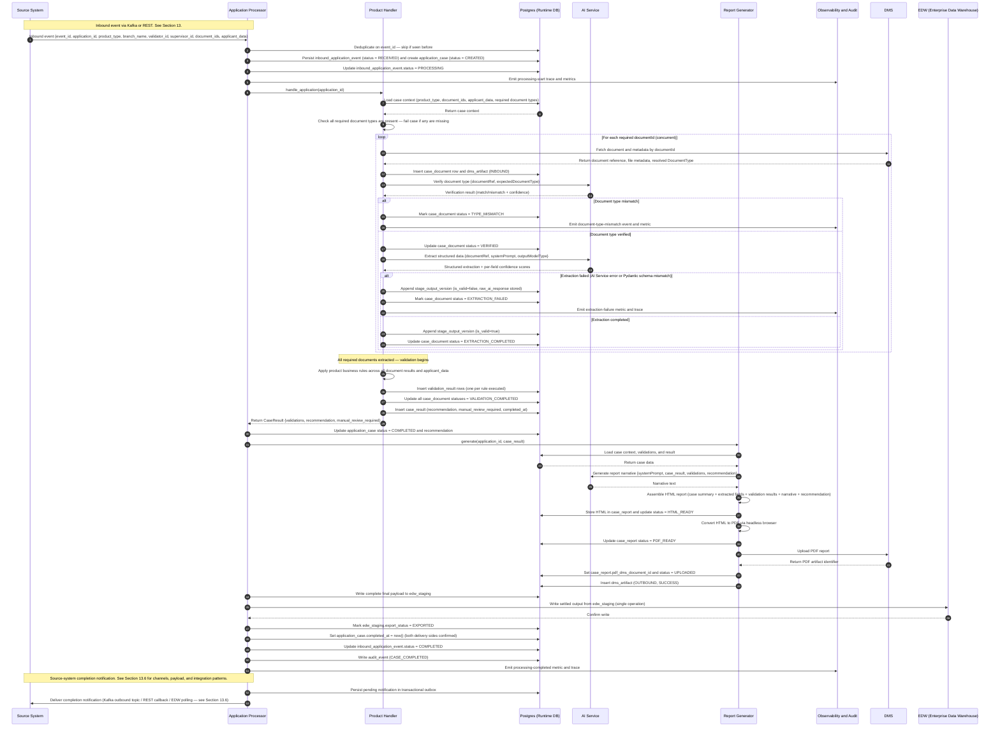
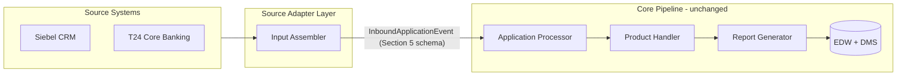
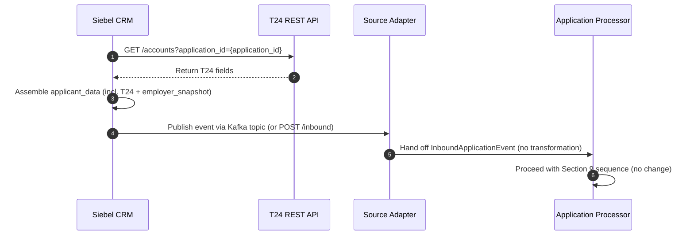
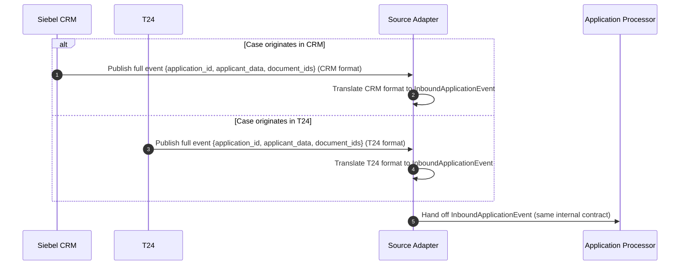
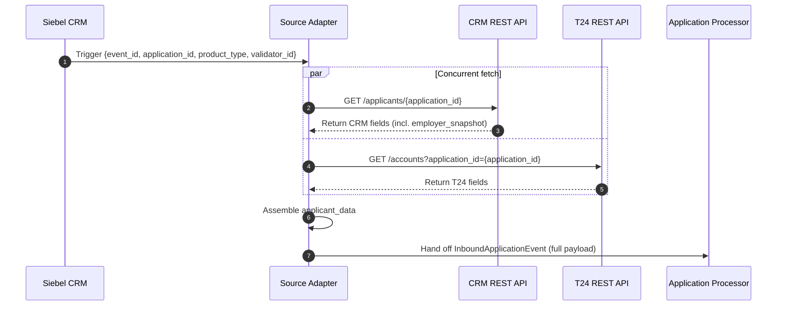
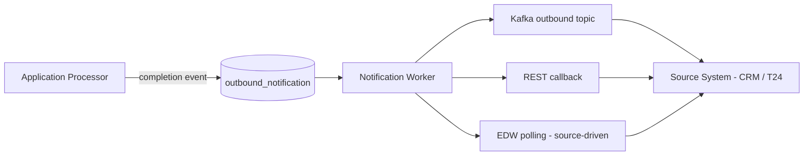

# AI Credit Underwriting Platform — System Design

---

## Business Case

Alinma Bank processes credit applications by assigning each case to a human Validator. Today, that Validator manually fetches supporting documents from the Document Management System (DMS), reads each one, extracts key data fields, cross-checks those fields against the applicant's CRM record, applies business rules, and writes a recommendation. This process is slow, inconsistent across validators.

**Our solution eliminates the manual extraction and validation work.** When Siebel CRM submits a credit application, this platform:

1. Automatically fetches all required documents from DMS.
2. Verifies each document is visually what it claims to be (using AI).
3. Extracts structured data fields from each document (using AI).
4. Applies the product's business validation rules to the extracted data against the applicant's CRM records.
5. Generates a structured, human-readable PDF report summarising the case, all validations, and a system recommendation (NO_ISSUES / HOLD / DECLINE).
6. Delivers the PDF back into DMS and the structured data into the Enterprise Data Warehouse (EDW), so the Validator receives a complete, ready-to-act case package.

The Validator's role shifts from manual data gathering to reviewing a pre-assembled report and acting on the recommendation. Processing time drops significantly. Every extraction, every validation result, and every system decision is stored immutably for compliance and audit.

---

## Part I — Architectural Decision Record (ADR)

> ADRs capture **why** the system is designed the way it is. They are the long-term rationale behind every major technical choice. Read this section before reading the implementation details in Part II.

---

### 1. Purpose and Context

This platform automates credit application processing at Alinma Bank. When the source system (Siebel CRM in the MVP) submits a credit application event — over Kafka or a REST API call to our inbound endpoint — the system:

1. Fetches the application documents from DMS.
2. Verifies each document matches its declared type (using AI).
3. Extracts structured data from each document (using AI).
4. Applies business validation rules to the extracted data and the applicant's `applicant_data`, and records the outcomes.
5. Generates a self-contained PDF report (narrative written by AI).
6. Delivers the PDF to DMS and structured data to EDW so a human Validator can review the report inside Siebel CRM.

The platform is built on four fixed pillars:

| Pillar | What it means |
|---|---|
| Fixed **product types** | A closed set of credit products (e.g. Personal Finance, Auto Finance). Each gets its own handler class. Adding a product requires only a new class — no other code changes. |
| Fixed **document types** | A closed set of document kinds (e.g. ID Document, Salary Certificate). Each gets its own Pydantic model defining the fields AI must extract. |
| **AI Service** as the unified service | One AI Service handles document verification, data extraction, and narrative report generation. This avoids managing multiple AI infrastructure components and standardises prompt engineering, model versioning, and monitoring under one service. |
| **Postgres + EDW** as the two databases | Postgres holds all runtime state, intermediate results, audit trail, and the EDW staging buffer. EDW is the company-wide Enterprise Data Warehouse and receives only the settled final output, written exactly once per case. |

---

### 2. System Participants

| Participant | Role |
|---|---|
| **Siebel CRM** | Two interactions with this system: **(1) Event publisher** — triggers processing by publishing a credit-application event (over Kafka or a REST call to our inbound endpoint) with `applicant_data` and document identifiers. **(2) Output consumer** — reads the final PDF report from DMS and the structured case data from EDW once the pipeline completes, plus an optional completion notification (Section 13.6). The exact direction of calls (Siebel → us, or us → Siebel for a Pattern C pull or a REST callback) depends on the integration pattern chosen in Section 13. |
| **Kafka** | Event bus that buffers application-processing events and decouples Siebel CRM from pipeline latency. Events are durable and replayable. |
| **Application Processor** | Consumes Kafka events, creates the case in Postgres, invokes the product handler, receives the `CaseResult`, delegates report generation, and writes the final output to EDW. It coordinates the pipeline — it contains no business logic. |
| **Product Handler** | One class per `ProductType`. Owns the required document list, extraction routing, validation rules, and recommendation logic for that product. The Application Processor is unaware of product-specific rules. |
| **AI Service** | The single AI service for all AI tasks: document type verification, structured data extraction, and report narrative generation. All three calls use the same endpoint; the task is selected via the system prompt and expected output schema. |
| **Postgres** | Runtime database: job state, intermediate results, retries, audit trail, EDW staging buffer, HTML report storage. |
| **EDW** | Alinma's Enterprise Data Warehouse — an existing company-wide system. Receives the settled final output in a single write per case. EDW does not support mid-pipeline queries; all data is staged in Postgres first and written to EDW atomically at the end. |
| **DMS** | Document Management System. Source of application documents; destination for the final PDF report. |
| **Report Generator** | In-process service. Calls AI Service for narrative text, assembles the report in HTML (for full layout control), stores the HTML in Postgres, converts to PDF via headless browser, and writes the PDF to DMS. |
| **Observability and Audit** | Runtime logging is handled by `structlog` (structured JSON to stdout + rotating file). Immutable business audit records are written to Postgres (`audit_event`) for long-term queryable history. |
| **Validator / Supervisor** | Human bank staff. Validators review cases assigned to them. Supervisors review all cases under their team. Both interact only through the internal UI (described in Section 12) and through Siebel CRM — they have no direct interaction with this system's API or database. |

---

### 3. Architectural Decisions

| Decision | Rationale |
|---|---|
| **Async, transport-flexible event trigger** | The source system publishes a trigger event over Kafka (default) or a REST API call to our inbound endpoint. Both produce the same internal event and converge on the same pipeline (see Section 5 and Section 13.1). The Kafka path provides durable, replayable delivery — events queue safely if the processor is down. The REST path is offered for source systems that don't run a Kafka producer; it has no durable buffer on our side, so producers using REST own retry on transient errors. |
| **AI Service as the unified service** | A single AI Service endpoint handles document verification, extraction, and narrative generation. This avoids managing multiple AI infrastructure components and standardises prompt engineering, model versioning, and monitoring under one service. |
| **Document type verification before extraction** | Before extracting data, AI Service confirms the document visually matches its declared type (e.g. the file labelled SALARY_CERTIFICATE is actually a salary certificate). This catches mismatched or corrupted uploads early — before they produce misleading extraction results. |
| **Product handler strategy pattern** | `ProductType` resolves to one handler class that owns all business rules for that product. The Application Processor only coordinates; adding a new product requires only a new class with no changes to the Application Processor or any other component. |
| **Immutable versioned outputs** | Extraction and validation results are append-only versioned rows — never overwritten. This guarantees a complete, reproducible audit trail for compliance and diagnostics, and allows re-runs to be compared against prior runs. |
| **HTML-first report generation** | The report is assembled in HTML before being converted to PDF. HTML gives the Report Generator full control over layout: tables, conditional sections, colour coding, and structured visual hierarchy. Storing the HTML in Postgres allows report regeneration without re-running the full pipeline. |
| **Postgres + EDW dual-database strategy** | Postgres holds all runtime state and retries. EDW receives the settled final output in a **single write per case**, preceded by a staging write in Postgres. The staging row ensures no data loss if the EDW write is interrupted — the write retries from the staging row without re-running the pipeline. |
| **Dual handoff to Siebel via DMS and EDW** | Siebel CRM consumes two outputs: the PDF from DMS and the structured data from EDW. Handoff is only complete when both `pdf_dms_document_id` is non-null and `edw_staging.export_status` is `EXPORTED`. |
| **Self-contained processing event** | The Kafka event carries `applicant_data` alongside the document identifiers. Processing is fully self-contained once the event is consumed. A CRM outage cannot block in-flight applications. The trade-off is a larger event payload — CRM must include all fields needed for cross-checking at publish time. |

---

### 4. Explicit Assumptions

Every decision above relies on assumptions that are not derivable from the code alone. These are listed here so any reader unfamiliar with the project can understand what was taken as given.

| Assumption | Where it affects the design |
|---|---|
| AI Service is the only AI service available in this environment. No alternative AI provider is used. | All AI tasks (verification, extraction, narrative) go to one endpoint. No multi-provider routing is implemented. |
| AI Service supports structured output: given a system prompt and a Pydantic model schema, it returns a JSON response that can be validated against that schema. | Extraction uses typed Pydantic models. If AI Service cannot guarantee structured output, a parsing and fallback layer would be required. |
| DMS exposes document metadata including the `DocumentType` label set by the uploader. | The Product Handler uses this label as the `expectedDocumentType` in the AI verification call. If DMS does not expose this, the handler cannot determine which verification and extraction prompt to apply without an additional classification step. |
| DMS document identifiers are stable: a `documentId` that exists today will still exist and return the same document when retried minutes later. | Retry logic re-fetches documents by `documentId`. If DMS IDs are ephemeral or mutable, retries could fetch wrong documents. |
| `applicant_data` carried in the inbound event is the authoritative version of the applicant's record at the moment the pipeline starts. | Under Pattern A (Section 13.2) the system never calls Siebel CRM after consuming the event — it processes the snapshot at publish time, not any later CRM update. Under Pattern C (Section 13.4) the snapshot is taken when the Source Adapter performs its synchronous fetch, so it reflects source-system state at processing time. |
| The number of product types and document types is small and changes infrequently. | These are modelled in code, not in config tables. If the business requires non-developer-configurable product or document definitions, this design must be revised to support a database-driven configuration layer. |
| If Option B (Section 12) is chosen, the internal UI is a read-only portal — no case actions (approve, reject, override) are taken there; those happen in Siebel CRM. Under Option A there is no internal UI at all and Siebel CRM is the sole reviewer surface. | The UI backend, when present, exposes read-only API endpoints. No write operations are ever needed from the reviewer experience. |
| All external reference data required for validation — including SIMAH credit scores, SIMATI records, T24 account data, and any other bank-managed data source — is fully populated in `applicant_data` by the time the Application Processor runs. **Under Pattern A** (Section 13.2) the source system pre-fetches and embeds them at publish time. **Under Patterns B/C** (Sections 13.3 / 13.4) they may be embedded by the originating producer or fetched live by the Source Adapter from CRM / T24 read APIs. | The Application Processor itself never calls SIMAH / SIMATI / T24 directly — that logic, if needed, lives in the Source Adapter. If a required field is absent from `applicant_data` when the pipeline starts, validation cannot run for that field; the inbound event schema (or the adapter's fetch list) must be extended at the source before new cross-check rules can be applied. |
| The AI Service is deployed within the bank's on-premises infrastructure boundary. No applicant data, document content, or extracted field values leaves the bank's network at any point in the pipeline. | There are no data-residency or data-exfiltration constraints on the AI integration under this assumption. If the AI deployment model changes to a cloud-hosted provider, a full data classification and privacy review must be completed before integration proceeds. |

---

## Part II — Engineering Design Record (EDR)

> EDRs describe **how** the system is built. This is the technical specification developers follow to implement and maintain the platform.

---

### 5. Input Event Contract

The trigger event that starts processing can arrive over either of two transports — both produce the same internal `InboundApplicationEvent` and follow the same downstream pipeline (see Section 13.1 for the Source Adapter that normalises them):

- **Kafka publish** — the source system publishes to the configured input topic. Durable, replayable, asynchronous.
- **REST API call to our system** — the source system POSTs the same payload to an inbound endpoint we expose. Synchronous, simpler for systems that don't run a Kafka producer.

Whichever transport is used, the payload must carry the fields below:

| Field | Type | Description |
|---|---|---|
| `event_id` | string (UUID) | Unique identifier for this event. Used for deduplication at consumption time — if the same `event_id` is seen twice, the second occurrence is dropped. |
| `application_id` | string | Business identifier for the credit application in Siebel CRM. |
| `product_type` | string | Value of the `ProductType` enum — used to resolve the product handler class. If the value does not match a registered handler, the event is rejected immediately and written to `dead_letter_event`. |
| `branch_name` | string | The name of the bank branch where the application was submitted. Stored for audit and reporting purposes only — not used in processing logic. |
| `validator_id` | string | The Siebel CRM user ID of the bank staff member who will **review** this case in the Workbench. Used for ownership scoping (the Workbench restricts each Validator to cases where `application_case.validator_id == user_id`). |
| `supervisor_id` | string | The Siebel CRM user ID of the supervisor of the reviewing validator. Stored for ownership hierarchy and UI access control. |
| `document_ids` | array of string | List of DMS document identifiers to fetch and process. Each entry resolves to one document. The Product Handler determines which document types it requires; documents not required by the handler are silently ignored. |
| `applicant_data` | object | The applicant's records as held by Siebel CRM at submission time, including all fields pre-fetched from external systems (e.g. SIMAH score, SIMATI data, T24 account details, name, ID number, date of birth, employer, salary). Carried in the event so the system can cross-check extracted document fields without ever calling any external system directly. **Must include an `employer_snapshot` sub-object** — see schema below. |

#### 5.1 `applicant_data.employer_snapshot` sub-schema

The Personal Finance handler (and any future product handler that varies its required-document set or rules by employer) reads the employer context from this sub-object. CRM resolves the employer record against the governed employer-rules source and embeds the snapshot at publish time so the processor never fetches employer data itself.

| Field | Type | Description |
|---|---|---|
| `employer_id` | string | Canonical employer identifier from the rules source. |
| `employer_name_normalized` | string | Canonical normalised name — used as the comparison anchor for the employer-name validation. |
| `employer_class` | enum (`A`, `B`, `C`, `D`, `GOV`) | Employer class assigned by the governed rules source. Drives the required-document matrix. |

**Example event payload:**

```json
{
  "event_id": "f7c3a1b2-4d5e-4a6f-8b9c-0d1e2f3a4b5c",
  "application_id": "APP-2026-089341",
  "product_type": "PERSONAL_FINANCE",
  "branch_name": "Riyadh Main Branch",
  "validator_id": "CRM-USR-4821",
  "supervisor_id": "CRM-USR-1093",
  "document_ids": ["DMS-00192", "DMS-00193"],
  "applicant_data": {
    "name": "Mohammed Al-Harbi",
    "id_number": "1082345678",
    "date_of_birth": "1985-04-12",
    "employer": "Saudi Aramco",
    "declared_salary": 18500.00,
    "simah_score": 720,
    "t24_account_id": "T24-ACC-998821",
    "employer_snapshot": {
      "employer_id": "EMP-ARAMCO",
      "employer_name_normalized": "SAUDI ARAMCO",
      "employer_class": "A"
    }
  }
}
```

> **To be confirmed with infrastructure team before implementation:** Kafka message key (recommended: `application_id` for partition locality) and event schema version field for forward compatibility.

> **To be confirmed with DMS integration team before implementation:** The mechanism by which `DocumentType` is resolved for each `document_id`. The system assumes DMS metadata includes the uploader-assigned document type label. If it does not, an additional classification step is required before verification can begin.

---

### 6. Code Model

Product and document behaviour is modelled in code — not in the database. Each product type has a dedicated handler class; each document type has a dedicated Pydantic model. **Numeric thresholds and the recommendation mapping live in `validation_config.yaml`** — see Section 8.3 — so they can be tuned without a code deployment, while the validation *logic* (which rules exist, how they branch on the data) stays under code review.

> **MVP coverage callout.** The enums below are illustrative of the patterns; the production scope per the BRD is broader (Personal Finance, Credit Cards, Auto Lease, Real Estate Mortgage; ID, Salary Certificate, Salary Transfer Letter, Subscription & Wage Certificate, Health-Check Form, Insurance Form). The MVP implements `PERSONAL_FINANCE` (+ `AUTO_FINANCE` placeholder) and `ID_DOCUMENT` + `SALARY_CERTIFICATE`. Adding the remaining product handlers and document extraction schemas is scoped as backlog and follows the extension recipe in Section 6.1 / 6.2.

#### 6.1 Product types

```python
class ProductType(str, Enum):
    # To support a new credit product, add an entry here and create a new handler class.
    # No other file needs to change.
    PERSONAL_FINANCE = "PERSONAL_FINANCE"
    CREDIT_CARDS = "CREDIT_CARDS"
    AUTO_LEASE = "AUTO_LEASE"
    REAL_ESTATE_MORTGAGE = "REAL_ESTATE_MORTGAGE"


@dataclass
class RequiredDocumentSet:
    # The handler tells the Application Processor what to expect *for this applicant*,
    # because the required set may depend on `applicant_data` — most importantly
    # the employer class snapshot.
    required: set[DocumentType]                  # must all be present
    optional: set[DocumentType] = set()          # accepted if present, ignored if absent
    unsupported: set[DocumentType] = set()       # must not be present; flagged if uploaded


class BaseProductHandler(ABC):
    product_type: ProductType  # declares which product this handler owns

    @abstractmethod
    def required_documents(self, applicant_data: dict) -> RequiredDocumentSet:
        # Each handler declares the document set it needs *given the applicant
        # context*. Personal Finance, for example, branches on
        # `applicant_data["employer_snapshot"].employer_class`:
        #   Class A   → ID + Salary Certificate
        #   Class B   → ID + Salary Certificate + Salary Transfer Letter
        #   Class C/D → ID + Subscription & Wage Certificate
        # The Application Processor uses the returned set to check completeness
        # before invoking validate().
        raise NotImplementedError

    @abstractmethod
    def validate(
        self,
        application_id: str,
        applicant_data: dict,
        document_results: list[DocumentResult],
    ) -> tuple[list[ValidationResult], Recommendation, str]:
        """
        Single entry point for product-specific validation.

        Receives the document results already produced by the Application Processor
        (each one has been fetched, verified, and extracted) and applies product
        business rules across them and `applicant_data`. Aggregates rule outcomes
        into a list of ValidationResult, derives a Recommendation, and emits a
        free-form rationale string. The Application Processor never iterates
        documents and never calls AI Service directly — that is the handler's
        responsibility upstream of validate().

        Every ValidationResult is stamped with `config_version` so the audit trail
        is reproducible across config / rules updates.
        """
        raise NotImplementedError
```

##### 6.1.1 Worked example — `PersonalFinanceHandler.validate()`

The following is a minimal, illustrative implementation showing how the handler
consumes `document_results` and `applicant_data`, emits one `ValidationResult`
per rule, and derives a `Recommendation` from the outcome mix. It is intended
to make the data flow concrete — production rules are richer.

```python
class PersonalFinanceHandler(BaseProductHandler):
    product_type = ProductType.PERSONAL_FINANCE

    def validate(self, application_id, applicant_data, document_results):
        # 1. Index document results by type for direct field access.
        id_doc = next(d for d in document_results
                      if d.document_type == DocumentType.ID_DOCUMENT)
        salary_doc = next(d for d in document_results
                          if d.document_type == DocumentType.SALARY_CERTIFICATE)

        results: list[ValidationResult] = []

        # 2. Cross-check rule: ID number on the document matches CRM record.
        crm_id = applicant_data["id_number"]
        extracted_id = id_doc.fields.id_number  # ExtractedField[str]
        results.append(ValidationResult(
            rule_code="ID_NUMBER_MISMATCH",
            input_data={"crm": crm_id, "document": extracted_id.value},
            outcome=ValidationOutcome.PASS if extracted_id.value == crm_id
                    else ValidationOutcome.HARD_BREACH,
            details={"expected": crm_id, "actual": extracted_id.value},
            confidence=extracted_id.confidence,
        ))

        # 3. Tolerance rule: declared salary vs. salary certificate (yaml-driven).
        cfg = get_validation_config()
        tolerance = cfg.personal_finance.salary_deviation_tolerance  # e.g. 0.10
        declared = Decimal(str(applicant_data["declared_salary"]))
        actual = salary_doc.fields.total_salary.value
        deviation = abs(declared - actual) / declared
        results.append(ValidationResult(
            rule_code="SALARY_DEVIATION",
            input_data={"declared": float(declared), "certificate": float(actual)},
            outcome=ValidationOutcome.PASS if deviation <= tolerance
                    else ValidationOutcome.SOFT_MISMATCH,
            details={"deviation_pct": float(deviation), "tolerance": tolerance},
            confidence=salary_doc.fields.total_salary.confidence,
        ))

        # 4. Map the outcome mix to a Recommendation via the yaml mapping.
        #    Precedence: HARD_BREACH > MANUAL_REVIEW > SOFT_MISMATCH > LOW_CONFIDENCE.
        outcomes = {r.outcome for r in results}
        mapping = cfg.recommendation_mapping
        if ValidationOutcome.HARD_BREACH in outcomes:
            recommendation = mapping.on_hard_breach           # DECLINE
        elif ValidationOutcome.SOFT_MISMATCH in outcomes:
            recommendation = mapping.on_soft_mismatch          # HOLD
        else:
            recommendation = mapping.default                   # NO_ISSUES

        rationale = f"{len(results)} rules evaluated; recommendation={recommendation}"
        # 5. Stamp config_version onto every row before returning (audit contract).
        return self._stamp_versions(results), recommendation, rationale
```

**Example data flow** — given the sample event `APP-2026-089342`
(`declared_salary=25000`, salary certificate `total_salary=18500`, tolerance
`0.10`):

| Rule | Outcome | Why |
|---|---|---|
| `ID_NUMBER_MISMATCH` | `PASS` | Extracted ID matches `applicant_data.id_number` |
| `SALARY_DEVIATION` | `SOFT_MISMATCH` | Deviation ≈ 0.26, exceeds 0.10 tolerance |

Recommendation resolves to `HOLD` via `recommendation_mapping.on_soft_mismatch`.
The handler returns two `ValidationResult` rows, each stamped with the YAML
`config_version` — both rows persist to `validation_result` and surface in the
report, the workbench, and the EDW payload.

---

#### 6.2 Document types

```python
class DocumentType(str, Enum):
    # Each entry maps to exactly one Pydantic model below.
    # AI Service uses the document type to select the right verification and extraction prompt.
    ID_DOCUMENT = "ID_DOCUMENT"
    SALARY_CERTIFICATE = "SALARY_CERTIFICATE"


class IdDocumentModel(BaseModel):
    id_number: ExtractedField[str]
    customer_name: ExtractedField[str]
    date_of_birth: ExtractedField[date | None]


class SalaryCertificateModel(BaseModel):
    employee_name: ExtractedField[str]
    employer_name: ExtractedField[str]
    basic_salary: ExtractedField[Decimal | None]
    net_salary: ExtractedField[Decimal | None]
```

#### 6.2.1 Extracted field metadata

Every field extracted from a document is wrapped in `ExtractedField[T]`. This wrapper carries the metadata required for validation routing, audit, and report generation:

```python
class ExtractedField[T](BaseModel):
    value: T                        # The extracted value
    confidence: float               # AI confidence score (0.0–1.0)
    source_document_name: str       # Document filename from which this field was extracted
    page_reference: int             # Page number in the source document (1-indexed)
    normalized_label: str           # Canonical label used for display and validation routing
```

The wrapper ensures every extracted value is paired with its confidence score and source context. Validators access `field.value` directly; the wrapper metadata supports audit, human review, and LOW_CONFIDENCE rule triggering.

#### 6.3 Code ownership boundaries

The following concerns are owned by code, not the database. They must not be stored in config tables — they are part of the application's business logic and must be reviewed and tested as code:

- Document type definitions and their Pydantic extraction models.
- Product-to-document requirement definitions (`required_documents` per handler).
- Extraction schema routing by document type (which Pydantic model AI Service populates).
- Business validation rules applied by each product handler.
- `rule_code` string identifiers (e.g. `SALARY_EMPLOYER_MATCH`, `ID_NAME_CHECK`) — defined and owned by each handler class. The logic behind each code is inseparable from the handler that executes it.

#### 6.4 Case result contract

The product handler returns a single `CaseResult` to the Application Processor. This object contains everything the Report Generator needs to render the report and everything the EDW write needs to deliver the final output.

```python
class Recommendation(str, Enum):
    NO_ISSUES = "NO_ISSUES"
    HOLD = "HOLD"
    DECLINE = "DECLINE"


class ValidationOutcome(str, Enum):
    # Every named rule always emits exactly one row; PASS is the outcome when the
    # rule clears. Ops prioritises review: hard breaches first, then soft mismatches,
    # then low-confidence extractions, then manual-review items; PASS rows are
    # collapsed into a separate "Passed rules" section in the report and workbench.
    PASS = "PASS"                                        # rule cleared — no issue found
    HARD_BREACH = "HARD_BREACH"                         # blocking rule failure
    SOFT_MISMATCH = "SOFT_MISMATCH"                     # non-blocking discrepancy vs. CRM values
    LOW_CONFIDENCE = "LOW_CONFIDENCE"                   # AI confidence below threshold
    MANUAL_REVIEW_REQUIRED = "MANUAL_REVIEW_REQUIRED"   # cannot be automated in MVP


class ValidationResult(BaseModel):
    rule_code: str                  # product-defined identifier (e.g. "SALARY_EMPLOYER_MATCH")
    input_data: dict[str, object]   # data the rule consumed — from extracted fields and/or applicant_data
    outcome: ValidationOutcome
    details: dict[str, object]      # rule-specific output (reason, expected vs. actual, failing condition)
    confidence: float | None = None # AI confidence score, if the rule depends on an extraction result
    manual_review_required: bool = False


class CaseResult(BaseModel):
    application_id: str
    product_type: ProductType
    validations: list[ValidationResult]
    recommendation: Recommendation
    manual_review_required: bool = False
    completed_at: datetime
```

---

### 7. AI Service Integration

AI Service is called at three distinct points in the pipeline. All three calls go to the same endpoint; the task is selected via the system prompt and the expected output schema.

| Caller | Purpose | Input | Output |
|---|---|---|---|
| **Product Handler** (verification) | Confirm the document visually matches its declared `DocumentType`. Catches mismatched or corrupted uploads before they produce misleading extraction results. | Document reference + expected document type | Verification result: match / mismatch + confidence score |
| **Product Handler** (extraction) | Extract structured data from the document into the typed Pydantic model for that document type. | Document reference + system prompt + target output model schema | Validated structured extraction + per-field confidence scores |
| **Report Generator** | Generate a human-readable narrative summarising the case outcome for the Validator. | System prompt + `CaseResult` + validations + recommendation | Narrative text: recommendation summary, validation explanations, reviewer notes |

---

### 8. Database Schema

All runtime state is held in Postgres. The schema is designed for idempotent retries and a complete audit trail.

**Append-only tables.** `stage_output_version` and `validation_result` are strictly append-only: a new row is always written for each attempt or rule execution; no row is ever updated or deleted. These tables form the immutable audit backbone of every case.

**Status-tracking tables.** `application_case`, `case_document`, `case_report`, `edw_staging`, and `processing_job` use in-place status updates. Each status column advances through a monotonic, forward-only state machine — no status can revert to a prior state. This is a deliberate trade-off: append-only history for outputs, mutable state for lifecycle tracking.

#### Tables

**`inbound_application_event`** — One row per inbound event received (over Kafka or via REST). Used for deduplication.

> **FK note:** `application_case.event_id` references `inbound_application_event.event_id` (the business deduplication key, declared UNIQUE), not `inbound_application_event.id` (the surrogate PK). This makes event tracing natural without a join on the surrogate key.

| Column | Type | Notes |
|---|---|---|
| `id` | UUID PK | |
| `event_id` | UUID UNIQUE NOT NULL | Deduplication key — checked at consumption time |
| `application_id` | string NOT NULL | Business key from CRM |
| `product_type` | string | Resolved from the event payload at ingest |
| `raw_payload` | JSONB NOT NULL | Full inbound payload stored for replay |
| `received_at` | timestamptz NOT NULL | |
| `status` | string NOT NULL | `RECEIVED` (default) → `PROCESSING` → `COMPLETED` / `FAILED` |
| `updated_at` | timestamptz NOT NULL | Last status transition timestamp |

---

**`application_case`** — One row per application being processed. Tracks the top-level case state.

> **Resubmission note:** The UNIQUE constraint on `application_id` is intentional but is lifted on resubmission. When a new event arrives with the same `application_id`, the prior case row is marked `SUPERSEDED` and a fresh `application_case` row is created — see Section 11.2 for the full resubmission policy.

> **`manual_review_required` vs `MANUAL_INTERVENTION_REQUIRED` status:** These serve distinct purposes. The boolean is set immediately when the handler returns and drives the Workbench priority banner — it means the system made a recommendation but flagged at least one rule for human review. The `MANUAL_INTERVENTION_REQUIRED` status means the pipeline itself could not complete without human action (e.g., missing documents after retry exhaustion). A case can have `manual_review_required = true` and `status = COMPLETED` simultaneously.

| Column | Type | Notes |
|---|---|---|
| `id` | UUID PK | |
| `application_id` | string UNIQUE NOT NULL | |
| `event_id` | UUID NOT NULL FK → `inbound_application_event.event_id` | Enforced via `fk_application_case_event_id` |
| `product_type` | string NOT NULL | |
| `branch_name` | string NOT NULL | |
| `validator_id` | string NOT NULL | The Workbench user who will review this case (not necessarily the submitter) |
| `supervisor_id` | string NOT NULL | |
| `applicant_data` | JSONB NOT NULL | Snapshot from the inbound event — authoritative for this case. Includes the `employer_snapshot` sub-object (Section 5.1) when the product handler needs employer context |
| `status` | string NOT NULL | `CREATED` → `IN_PROGRESS` → `COMPLETED` (or `FAILED` / `MANUAL_INTERVENTION_REQUIRED` / `SUPERSEDED`). `COMPLETED` means business processing produced a recommendation; delivery state lives on `case_report` and `edw_staging`. `SUPERSEDED` is set on the prior case row when a new event arrives with the same `application_id` — see Section 11.2 |
| `recommendation` | string | `NO_ISSUES`, `HOLD`, `DECLINE` — set after handler completes |
| `recommendation_rationale` | text | Free-form rationale string emitted alongside the recommendation |
| `manual_review_required` | boolean NOT NULL DEFAULT false | |
| `error_detail` | text | Top-level pipeline failure description. Set whenever `status` is `FAILED` or `MANUAL_INTERVENTION_REQUIRED`. Never silently null on failure — every error path captures here |
| `created_at` | timestamptz NOT NULL | |
| `updated_at` | timestamptz NOT NULL | Last status transition timestamp |
| `completed_at` | timestamptz | Set only when **both** the report has been uploaded to DMS **and** the EDW write has been confirmed. Stays NULL if either delivery side fails — the failure is captured on the relevant child row (`case_report.error_detail` / `edw_staging.export_error`) for independent retry |

---

**`case_document`** — One row per document within a case. Tracks verification and extraction state per document.

| Column | Type | Notes |
|---|---|---|
| `id` | UUID PK | |
| `case_id` | UUID NOT NULL FK → `application_case` | |
| `dms_document_id` | string NOT NULL | Source identifier in DMS |
| `document_type` | string | Resolved from DMS metadata once the fetch succeeds |
| `document_name` | string | Filename as reported by DMS |
| `status` | string NOT NULL | `PENDING` → `FETCHED` → `VERIFIED` / `TYPE_MISMATCH` / `VERIFICATION_FAILED` → `EXTRACTION_COMPLETED` / `EXTRACTION_FAILED` → `VALIDATION_COMPLETED` |
| `verification_result` | string | `MATCH`, `MISMATCH` |
| `verification_confidence` | float | AI confidence on the type verification call |
| `fetched_at` | timestamptz | |
| `verified_at` | timestamptz | |
| `error_detail` | text | DMS or AI failure description. Set on any `*_FAILED` status; never silent |
| `updated_at` | timestamptz NOT NULL | Last status transition timestamp |

---

**`stage_output_version`** — Append-only extraction versions. A new row is written for each extraction attempt. Never updated.

| Column | Type | Notes |
|---|---|---|
| `id` | UUID PK | |
| `case_document_id` | UUID NOT NULL FK → `case_document` | |
| `version` | integer NOT NULL | Monotonically increasing per document |
| `raw_extraction` | JSONB NOT NULL | Full typed extraction result (all `ExtractedField` wrappers serialised) |
| `is_valid` | boolean NOT NULL | False if Pydantic schema validation failed |
| `validation_error` | text | Schema validation error message if `is_valid = false` |
| `raw_ai_response` | JSONB | Raw AI Service response — retained for diagnostics |
| `extracted_at` | timestamptz NOT NULL | |

---

**`validation_result`** — One row per business rule executed, per case. Append-only.

| Column | Type | Notes |
|---|---|---|
| `id` | UUID PK | |
| `case_id` | UUID NOT NULL FK → `application_case` | |
| `rule_code` | string NOT NULL | Identifies the business rule (e.g. `SALARY_EMPLOYER_MATCH`) |
| `outcome` | string NOT NULL | `PASS`, `HARD_BREACH`, `SOFT_MISMATCH`, `LOW_CONFIDENCE`, `MANUAL_REVIEW_REQUIRED` |
| `input_data` | JSONB NOT NULL | Full input data the rule consumed — mirrors `ValidationResult.input_data` verbatim; preserved for audit and replay |
| `details` | JSONB NOT NULL | Full rule-specific output — mirrors `ValidationResult.details` verbatim; preserved for audit and report rendering |
| `description` | text NOT NULL | Human-readable explanation of the outcome (rendered in the report) — promoted projection from `details` for display |
| `field_name` | string | Field the rule operated on, when applicable — promoted projection from `details` for indexed search |
| `extracted_value` | text | Value pulled from the document — promoted projection from `input_data` for indexed search |
| `expected_value` | text | Value the rule expected (e.g. CRM record) — promoted projection from `input_data` for indexed search |
| `confidence` | float | AI confidence, if applicable |
| `manual_review_required` | boolean NOT NULL DEFAULT false | |
| `rule_version` | string | Identifier of the handler rule logic that produced this row (when the rule itself is versioned). Nullable |
| `config_version` | string | Mirrors `validation_config.yaml`'s `version` at evaluation time. Stamped automatically by the handler base class so threshold / mapping changes are reproducible (see Section 8.3) |
| `evaluated_at` | timestamptz NOT NULL | |

---

**`case_result`** — The aggregated handler output. One row per completed case.

> **`completed_at` semantics:** `case_result.completed_at` records when the product handler finished (business processing time). `application_case.completed_at` records when the full pipeline — including report upload and EDW write — completed (delivery time). Both are retained for separate operational and business reporting purposes.

| Column | Type | Notes |
|---|---|---|
| `id` | UUID PK | |
| `case_id` | UUID UNIQUE NOT NULL FK → `application_case` | |
| `recommendation` | string NOT NULL | |
| `manual_review_required` | boolean NOT NULL | |
| `completed_at` | timestamptz NOT NULL | Handler completion time — see semantics note above |

---

**`case_report`** — Report generation output. One row per case, updated as report stages complete.

| Column | Type | Notes |
|---|---|---|
| `id` | UUID PK | |
| `case_id` | UUID UNIQUE NOT NULL FK → `application_case` | |
| `html_content` | text | Full assembled HTML report — stored for regeneration without re-running the pipeline |
| `narrative` | text | The AI-generated narrative text |
| `pdf_dms_document_id` | string | DMS identifier of the uploaded PDF — null until upload is confirmed |
| `html_generated_at` | timestamptz | |
| `pdf_generated_at` | timestamptz | |
| `pdf_uploaded_at` | timestamptz | |
| `status` | string NOT NULL | `PENDING` → `HTML_READY` → `PDF_READY` → `UPLOADED`. Any failure (generation or DMS upload) sets `FAILED` with `error_detail` populated |
| `error_detail` | text | Description of the failure if `status = FAILED`. Cleared on successful re-upload |
| `updated_at` | timestamptz NOT NULL | Last status transition timestamp |

---

**`dms_artifact`** — Tracks every DMS interaction (both fetched documents and uploaded PDFs).

| Column | Type | Notes |
|---|---|---|
| `id` | UUID PK | |
| `case_id` | UUID NOT NULL FK → `application_case` | |
| `dms_document_id` | string NOT NULL | |
| `artifact_type` | string NOT NULL | `SOURCE_DOCUMENT`, `PDF_REPORT` |
| `direction` | string NOT NULL | `INBOUND` (fetched), `OUTBOUND` (uploaded) |
| `status` | string NOT NULL | `SUCCESS`, `FAILED` |
| `error_details` | JSONB | |
| `interacted_at` | timestamptz NOT NULL | |

---

**`processing_job`** — Tracks retryable job execution. One row per job attempt lifecycle.

| Column | Type | Notes |
|---|---|---|
| `id` | UUID PK | |
| `case_id` | UUID NOT NULL FK → `application_case` | |
| `job_type` | string NOT NULL | `DOCUMENT_FETCH`, `VERIFY_AND_EXTRACT`, `REPORT_GENERATION`, `REPORT_UPLOAD`, `EDW_WRITE` (verification + extraction share one AI call, so they share one job row) |
| `status` | string NOT NULL | `PENDING`, `IN_PROGRESS`, `COMPLETED`, `FAILED`, `RETRYING` |
| `attempt_count` | integer NOT NULL DEFAULT 0 | |
| `max_attempts` | integer NOT NULL | |
| `last_error` | text | |
| `last_attempted_at` | timestamptz | |
| `completed_at` | timestamptz | |
| `updated_at` | timestamptz NOT NULL | Last status transition timestamp |

---

**`dead_letter_event`** — Terminal failures. Events that have exhausted retries or are invalid.

| Column | Type | Notes |
|---|---|---|
| `id` | UUID PK | |
| `event_id` | UUID | FK → `inbound_application_event.event_id` (UNIQUE column). NULLable: events that fail schema validation never produce an inbound row |
| `case_id` | UUID | FK → `application_case.id` if a case was created before failure |
| `application_id` | string | Business key, when known |
| `reason_code` | string NOT NULL | e.g. `MAX_RETRIES_EXCEEDED`, `INVALID_EVENT_SCHEMA`, `UNSUPPORTED_PRODUCT_TYPE`, `MISSING_REQUIRED_DOCUMENTS`, `UNHANDLED_PIPELINE_EXCEPTION` |
| `error_detail` | text | Human-readable failure description |
| `raw_payload` | JSONB | Full original payload for deterministic replay |
| `stack_trace` | text | If caused by an unhandled exception |
| `created_at` | timestamptz NOT NULL | |
| `replayed_at` | timestamptz | Set when a human operator replays the event |

---

**`edw_staging`** — The settled final record for a completed application. Written once when the pipeline completes and kept permanently in sync with the EDW database table of the same structure. This table is the workbench's single source of truth: all case list and case detail queries read from here exclusively, never from the pipeline tables. The promoted scalar columns (`validator_id`, `recommendation`, `status`, etc.) support indexed filtering and role scoping without JSONB access; `payload` carries the full structured output for the detail view and for the EDW write.

| Column | Type | Notes |
|---|---|---|
| `id` | UUID PK | |
| `case_id` | UUID UNIQUE NOT NULL FK → `application_case` | |
| `application_id` | string NOT NULL | Business key — promoted for indexed lookup without JSONB access |
| `validator_id` | string NOT NULL | Promoted from `application_case` — supports role-scoped queries |
| `supervisor_id` | string NOT NULL | Promoted from `application_case` — supports role-scoped queries |
| `product_type` | string NOT NULL | Promoted — supports dashboard filtering |
| `branch_name` | string NOT NULL | Promoted — available for reporting without JSONB access |
| `applicant_name` | string | Extracted from `applicant_data.name` at staging time — supports search |
| `status` | string NOT NULL | Final case status at completion time |
| `recommendation` | string | `NO_ISSUES`, `HOLD`, `DECLINE` — promoted for dashboard filtering |
| `manual_review_required` | boolean NOT NULL | Promoted — surfaces priority flag without JSONB access |
| `pdf_dms_document_id` | string | DMS identifier of the uploaded PDF report |
| `error_detail` | text | Top-level pipeline error if any, promoted for the workbench exceptions panel |
| `payload` | JSONB NOT NULL | Complete denormalised output: applicant data, extracted fields, validation results, employer snapshot, manual checks, technical exceptions, report metadata, and audit timeline. This is the exact payload written to the EDW table — `edw_staging` and EDW always hold the same structure |
| `export_status` | string NOT NULL | `STAGED` (default) → `EXPORTED` / `EXPORT_FAILED`. `EXPORT_FAILED` rows are retried independently of the pipeline since `payload` already contains the settled output |
| `edw_confirmation_id` | string | Identifier returned by EDW on a successful write |
| `staged_at` | timestamptz NOT NULL | |
| `exported_at` | timestamptz | |
| `export_error` | text | Failure description from the most recent EDW write attempt |
| `created_at` | timestamptz NOT NULL | Mirrored from `application_case.created_at` — supports date-sorted dashboard queries |
| `completed_at` | timestamptz | Mirrored from `application_case.completed_at` |
| `updated_at` | timestamptz NOT NULL | Last status transition timestamp |

---

**`audit_event`** — Immutable audit log. One row per business-significant action. Never deleted or updated.

| Column | Type | Notes |
|---|---|---|
| `id` | UUID — part of composite PK with `occurred_at` | |
| `occurred_at` | timestamptz NOT NULL — part of composite PK; partition key | |
| `case_id` | UUID FK → `application_case` | |
| `application_id` | string | Business key, denormalised for cross-case queries |
| `event_type` | string NOT NULL | `CASE_CREATED`, `DOCUMENT_FETCHED`, `EXTRACTION_COMPLETED`, `DOCUMENT_TYPE_MISMATCH`, `VALIDATION_COMPLETED`, `REPORT_UPLOADED`, `EDW_EXPORTED`, `CASE_COMPLETED`, `MISSING_REQUIRED_DOCUMENTS`, `CASE_FAILED` |
| `actor` | string | System component that generated this event |
| `detail` | JSONB | Event-specific data |

---

#### 8.3 Validation Configuration (`validation_config.yaml`)

Validation **logic** lives in code (handlers); validation **numbers** live in YAML so they can be tuned without a code deployment. The file is bundled with the application and loaded once per process.

```yaml
version: "2026.05.01"

# AI confidence threshold per document type. Fields below the applicable
# threshold emit a LOW_CONFIDENCE validation row.
confidence_thresholds:
  default: 0.70
  ID_DOCUMENT: 0.70
  SALARY_CERTIFICATE: 0.70

# Personal Finance numeric tolerances.
personal_finance:
  salary_deviation_tolerance: 0.10  # 10%

# Recommendation mapping. Outcomes are evaluated in precedence order:
#   HARD_BREACH > MANUAL_REVIEW_REQUIRED > SOFT_MISMATCH > LOW_CONFIDENCE > none
recommendation_mapping:
  on_hard_breach: DECLINE
  on_manual_review: HOLD
  on_soft_mismatch: HOLD
  on_low_confidence: HOLD
  default: NO_ISSUES
```

**Reproducibility contract.** Every `validation_result` row is stamped with the `version` string above (`config_version` column). When the file changes:

1. Bump `version` (any monotonic identifier — date-based works).
2. Restart the processor to load the new file.
3. New rows reference the new `config_version`; historical rows still reference whatever version was in force when they were written.

This guarantees the explainability PDF and the Workbench's checks table can always show *which* threshold version produced any given outcome.

**What does NOT belong in this file.** The validation logic itself — which rules exist, how they branch on data, what `rule_code` they emit — is owned by the handler classes and stays under code review. The YAML carries only thresholds, tolerances, and the outcome→recommendation mapping. If a behavioural change requires a new rule or a new branch, that is a code change.

---

### 9. End-To-End Sequence

#### Detailed Sequence

In the diagram below, `SRC` represents the source system — both as the input-event publisher (top of the diagram) and as the recipient of the completion notification (bottom). How the inbound event reaches us, and how the completion notification is delivered, are described in **Section 13**.



> Input ingestion (single-source push, push from one of multiple sources, or pull-on-demand) and the outbound completion notification are described in detail in **Section 13 — Source System Integration Patterns**. Whichever pattern is chosen, it plugs in *before* the `SRC → AP` arrow above without changing any of the steps below.

---

### 10. Non-Functional Requirements

#### 10.0 Throughput and Latency Targets

| Metric | Target |
|---|---|
| **Peak event volume** | 300 events per hour during working hours |
| **End-to-end SLA** | Case processing completed within **30 seconds** from event consumption to EDW write confirmation (95th percentile) |
| **AI Service budget** | All AI Service calls (verification + extraction + narrative) must complete within the 30-second SLA envelope. AI Service is the fixed bottleneck — monitor per-call latency and queue depth as the primary capacity signals (see Section 10.1). |

These targets drive the horizontal scaling model in Section 10.1 and inform the per-stage timeout thresholds that must be added when timeout logic is implemented.

#### 10.1 Horizontal Scaling

Inbound events arrive on two paths — a **single Kafka listener** for Kafka publishes and a **REST inbound endpoint** for API pushes — both feeding the same internal **load balancer**, which distributes work across a pool of Application Processor workers. Each worker handles one case at a time; adding workers increases throughput linearly. Postgres handles concurrent writes safely via row-level locking and idempotency checks on `application_id`. The database connection pool size must be configured per worker to avoid exhausting Postgres connections as the pool grows.

AI Service follows the same pattern: all AI calls go through a **single AI Service load balancer** that distributes requests across AI Service instances. The AI client URL points to the load balancer — no application code changes when capacity scales. Monitor AI Service request queue depth and per-call latency as the primary scaling signals.

#### 10.2 Document Handling at Scale

Documents are fetched from DMS into memory for verification and extraction, then discarded — they are not persisted to local disk or our own storage. Extraction results (structured JSON fields) and the HTML report are stored in Postgres, which is adequate for the expected data volumes per case. The PDF report is stored in DMS (the bank's existing document store), not in our database.

If document volume grows significantly (large files, high concurrency), fetching documents into application memory becomes a bottleneck. The mitigation strategy at that point is to introduce an object storage layer (e.g. an S3-compatible store): documents are written to object storage on first fetch, and subsequent steps reference the object store URL rather than re-fetching from DMS. This also allows the AI Service extraction step to consume documents directly from the store without passing them through the Application Processor's memory. This is not implemented in the MVP — it is the first scaling lever to pull if DMS fetch latency or memory pressure becomes a problem.

#### 10.3 Structured Logging and Observability

All runtime logging is handled by **structlog** (structured JSON to stdout + rotating file). No OTel SDK is used.

| Signal | What it captures |
|---|---|
| **Logs** | Structured JSON, key-value attributes (never embedded strings). Standard fields on every entry: `application_id`, `event_id`, `component`, `log_level`, `timestamp`, `message`. |

**Log level policy:** `DEBUG` — field values and internal transitions; `INFO` — pipeline milestones; `WARN` — degraded but non-blocking (low confidence, soft mismatch, retrying); `ERROR` — stage-blocking failures.

**Audit log** — business-significant events are also written to `audit_event` in Postgres: an immutable, queryable trail independent of log retention.

#### 10.4 Non-Error Points of Failure

Several failure modes in this system produce no error — they produce a technically valid but operationally wrong outcome. These are harder to detect than exceptions and require explicit monitoring.

**Silent AI confidence drift.** AI Service may extract a value with confidence 0.72 when the threshold for `LOW_CONFIDENCE` is 0.70. The extraction is accepted and the validation passes, but the value is near the boundary. If AI Service's confidence calibration degrades over time (e.g. after a model update), a growing proportion of cases may pass with near-threshold confidence without triggering any alert. Mitigation: track the distribution of confidence scores per document type over time in observability; alert if the mean drops or the low-tail grows.

**EDW write confirmed but schema mismatch accepted silently.** If the EDW write API returns HTTP 200 but silently truncates or coerces fields that do not match its internal schema, the `edw_staging` row is marked `EXPORTED` but the data in EDW is wrong. Mitigation: confirm with the EDW team that the write API returns a schema validation error on mismatch — do not assume a 200 response means the data was accepted correctly.

**DMS serving a stale cached version.** DMS may cache documents and return a stale version for a given `documentId` if the document was recently updated in CRM before submission. The system processes the cached version without error, but the extracted data does not reflect the latest document. Mitigation: confirm with the DMS team whether document updates invalidate the cache, and whether the document fetch API supports cache-busting.

**Identical `application_id`, different `event_id`.** A CRM retry after a timeout sends a new event with a new `event_id` for an application already in progress or completed. The deduplication check on `event_id` passes (new event), but processing a second time for the same `application_id` creates a conflict. The system does not silently overwrite the first case, but without a clear business rule for this scenario it cannot determine whether to reject or reprocess. Mitigation: the business must define what constitutes a legitimate resubmission versus a CRM retry — see Section 11.2.

---

### 11. Failure Handling

Failures are grouped into three categories: external (DMS, AI Service, Kafka, EDW), business/contract, and internal. All failures are logged with structured fields and written to `audit_event`. Terminal failures go to `dead_letter_event`.

**Terminal-state guarantee.** No error is ever silently swallowed or replaced with a default value. Every failure path captures the error in the most specific `error_detail` column available so the disrupted state is visible to ops:

- Pipeline-level / unhandled exceptions → `application_case.status = FAILED`, `application_case.error_detail` set, plus `dead_letter_event` row with full stack trace.
- Missing required documents → `application_case.status = MANUAL_INTERVENTION_REQUIRED`, `application_case.error_detail` set, plus `dead_letter_event` row.
- Per-document failures (DMS fetch, AI verify+extract, unknown document type) → `case_document.status = *_FAILED`, `case_document.error_detail` set; the case continues with whatever documents succeeded so the handler can emit an explicit HARD_BREACH for the missing input rather than the case silently passing.
- Report generation or upload failure → `case_report.status = FAILED`, `case_report.error_detail` set. `application_case.status` stays `COMPLETED` because business processing is done; `application_case.completed_at` stays NULL until the report is uploaded.
- EDW export failure → `edw_staging.export_status = EXPORT_FAILED`, `edw_staging.export_error` set. `application_case.completed_at` stays NULL until the export retry succeeds against the persisted staging payload.

`application_case.completed_at` is set **only** when both delivery sides (report uploaded, EDW exported) have succeeded. A NULL `completed_at` on a `COMPLETED` case is the unambiguous signal that something downstream is unresolved — the specific failure is on the relevant child row.

**Tech-exception vs business-outcome visual distinction.** Pipeline / integration failures (anything written to `*.error_detail` or `edw_staging.export_error`) are surfaced in both the Workbench detail view and the explainability PDF as a separate **Technical Exceptions** panel with a neutral grey, dashed-border palette — distinct from the business-outcome chips (green/amber/red) used for `ValidationOutcome`. This guarantees a reviewer never confuses a DMS outage or an AI 5xx with a rule decline.

---

#### 11.1 External system failures

> The behaviours below are the default design intent. All items require confirmation with the owning team before implementation.

**DMS.** Unavailability or timeout: exponential backoff retry, each attempt recorded in `processing_job`. On exhaustion: case moved to `dead_letter_event`, flagged for manual intervention. Document-not-found: stage marked failed; whether to retry (document temporarily unavailable) or fail permanently must be confirmed with the DMS team. PDF upload failure: `pdf_dms_document_id` left null, report job marked retryable, retry from stored HTML — no pipeline re-run needed. Whether repeated uploads with the same document identifier are idempotent must be confirmed with the DMS team.

**AI Service.** Service error or timeout: exponential backoff retry. Pydantic schema mismatch on extraction response: raw response and validation error persisted, stage marked retryable. If all retries fail: `dead_letter_event`, manual intervention flagged.

**Inbound transport (Kafka / REST).** *Kafka broker unavailable:* consumer group pauses, events remain durable in the topic, processing resumes automatically on reconnection. *REST inbound endpoint unavailable:* the source system gets a connection-refused / 5xx response and is responsible for retrying — there is no durable buffer on the REST path, so a brief outage on this side surfaces as a producer-side problem. Sources that need durability should use the Kafka path. *Invalid event* (missing fields, unrecognised `productType`, unsupported schema version): rejected immediately at consumption, raw payload written to `dead_letter_event`, no case created. *Duplicate event* (`event_id` already in `inbound_application_event`): dropped before any processing begins.

**EDW.** Write failure: `edw_staging` row remains intact, retried independently without re-running the pipeline. Schema rejection: `edw_staging` marked `EXPORT_FAILED`, surfaced via observability, manual correction required before retry. The EDW team must confirm idempotency guarantees and error response format.

---

#### 11.2 Business / event contract failures

**Same `application_id`, new `event_id`.** When a new event arrives carrying an `application_id` that already exists — regardless of the prior case's status — the system treats it as a resubmission and processes it as a new case. The existing case row is superseded: its status is set to `SUPERSEDED` and the new event creates a fresh `application_case` row. This policy ensures CRM retries after a timeout or resubmissions after a correction are always honoured without requiring manual intervention. The previous case's audit trail, validation rows, and report remain intact and queryable.

**Unsupported `product_type`.** Rejected at consumption, written to `dead_letter_event` with reason code `UNSUPPORTED_PRODUCT_TYPE`. Supporting a new product type requires only a new handler class — no other component changes.

---

#### 11.3 Internal system failures

**Postgres connection failure.** Retry with backoff. On persistent failure: current job marked failed, surfaced via observability, worker continues serving other jobs — it does not crash.

**Worker crash mid-job.** Job remains `IN_PROGRESS` in `processing_job`. A watchdog timeout detects the stalled job, marks it `FAILED`, and re-queues it. Because every stage is idempotent, the re-queued job checks whether output was already written before doing any work — no double-processing.

**Unhandled exception in product handler.** Caught at the Application Processor boundary. Job marked failed; full stack trace written to `dead_letter_event.stack_trace` and the raw event payload to `dead_letter_event.raw_payload` for diagnosis and replay.

**Max retries exceeded.** Job moved to `dead_letter_event` with reason code and last error details. Case flagged for manual intervention. Alert raised. Dead letter events are not retried automatically — manual investigation required before replay.

**Missing required documents.** Handler fails the case at the completeness check, persists the list of missing document types, and does not proceed. Case moves to `MANUAL_INTERVENTION_REQUIRED` status; `application_case.error_detail` records which document types were absent. The case stays in this state until the missing documents are provided and the case is replayed.

**Partial document success.** Completed extractions and validations are persisted. Failed documents remain in a retryable state. Case stays open until all required documents are resolved.

**Report HTML assembly failure.** `case_report.status = FAILED` with `error_detail` populated. Case retains its terminal business status (`COMPLETED`) and recommendation. `application_case.completed_at` stays NULL until the report is regenerated and uploaded.

**PDF conversion failure.** HTML is already safely in Postgres. `pdf_dms_document_id` left null, `case_report.status = FAILED` with `error_detail` populated. PDF conversion can be retried from stored HTML — no pipeline re-run.

---

### 12. Output Delivery Options

Once the pipeline completes, the Validator and Supervisor need to access the case results and the PDF report. Two delivery options are viable given the existing data architecture — the pipeline already writes a complete denormalised snapshot to `edw_staging` (mirrored to EDW) and uploads the PDF to DMS, so the data required by either option is always available at completion time. The choice is operational, not architectural.

#### Option A — EDW + DMS only (CRM-native, no internal UI)

The platform's only outputs are the PDF in DMS and the structured case payload in EDW. Siebel CRM reads both natively: the PDF appears in the CRM case viewer, and the structured data is surfaced via CRM's existing EDW integration. Validators and Supervisors stay entirely inside their existing CRM workflow — no new tool to learn, no separate authentication layer.

- **Pros:** zero UI development on this side; reviewers stay in CRM.
- **Cons:** the layout and detail of validations, recommendation, and document breakdown is controlled by the CRM team; real-time pipeline status (IN_PROGRESS, FAILED, retrying) is invisible unless CRM exposes EDW status fields; any change to what reviewers see depends on CRM team capacity.
- **Assumption:** the CRM team has an active EDW integration that can surface the structured payload fields and is willing to extend it for this use case. Must be confirmed before choosing Option A.

#### Option B — Internal Validator Workbench (custom UI owned by this team)

This team builds and operates a dedicated read-only internal web application. Validators see only their own cases; Supervisors see all cases under their team. The Workbench reads from a Postgres read replica and streams the PDF from DMS. No case actions (approve / reject / override) are taken in the Workbench — those remain in Siebel CRM.

- **Pros:** full control over the reviewer experience — real-time pipeline status, validation breakdowns with confidence scores, manual-review flags, technical-exceptions panel; MANUAL_INTERVENTION_REQUIRED cases can be pinned as priority banners; the UI evolves independently of CRM team capacity.
- **Cons:** frontend development, hosting, and ongoing maintenance; adds an authentication / access-control layer that must integrate with the bank's identity system; reviewers context-switch between two systems (Workbench to review, CRM to act).
- **Assumption:** the bank's identity system exposes an integration point (e.g. OAuth2 / SAML) that returns each user's `validator_id` / `supervisor_id`. Must be confirmed with the infrastructure team.

#### 12.1 Choosing

Both options use the same underlying outputs, so the choice is purely operational: whether the Validator experience is owned by the CRM team (A) or this team (B). Option A is lower-effort but depends on the CRM team's ability to surface EDW data with sufficient detail; Option B gives this team full control at the cost of building and operating a web application. If the CRM team cannot expose validation detail and real-time pipeline status from EDW, Option B is the only path to a complete reviewer experience.

---

### 13. Source System Integration Patterns

> Sections 5–11 describe the system as if a single source (Siebel CRM) publishes a single Kafka event carrying everything we need (`applicant_data` + `document_ids`). That contract is the easiest to operate, but in practice applicant data is owned across at least two systems — **Siebel CRM** (customer profile, employer, declared salary) and **T24** (core banking / account data). This section describes how the input path can vary without changing the core processing logic, and how the platform reports completion back to whichever system originated the request.

**Core invariant.** The Application Processor operates on a fully-formed `applicant_data` object plus a list of `document_ids`. Where those values come from is an integration concern, not a pipeline concern. **Sections 5–11 still apply unchanged once the input has been assembled** — only the component sitting *in front of* the Application Processor changes between patterns.

---

#### 13.1 Where the variation sits



The shaded **Source Adapter Layer** is the only thing that changes between integration patterns. Whether it consumes from Kafka, accepts a REST push, or calls outbound APIs, the contract it produces for the Application Processor is identical: an `InboundApplicationEvent` with the schema in Section 5. **Transport (Kafka vs REST) is orthogonal** to the patterns below — every pattern can be implemented over either, and the adapter normalises both into the same internal event.

---

#### 13.2 Pattern A — Push from a single source (MVP)

The current MVP. Siebel CRM is the orchestrator: it pre-fetches every field needed (including T24 account data and any external references) and publishes a single self-contained event.



| Property | Behaviour |
|---|---|
| Input shape | One event per case, fully populated |
| Coupling | Tight to CRM at publish time; no live dependency at processing time |
| Failure isolation | CRM outage does not affect in-flight cases — they own a snapshot |
| Risk | Stale snapshot — if T24 data changes between publish and processing, the event still reflects publish-time values |

---

#### 13.3 Pattern B — Push from one of multiple sources

Either source system can publish a complete event for a given case — but only one publishes per case (not both contributing slices). For example, retail-banking-originated cases may come from Siebel CRM while corporate-banking cases come from T24. Each source produces its own event format; the Source Adapter normalises both into the same internal `InboundApplicationEvent` before handing off.



| Property | Behaviour |
|---|---|
| Input shape | One self-contained event per case, from whichever source owns it |
| Coupling | Source-specific format adapters, but no cross-source coordination |
| Failure isolation | Producers are independent — a CRM outage does not affect cases originating in T24, and vice versa |
| Risk | Source-format drift — each producer's schema must be versioned and contract-tested independently |

> **To be confirmed with CRM, T24, and integration teams:** the topic / endpoint per source, the per-source event schema, that `application_id` is globally unique across producers, and version control for each source's contract.

---

#### 13.4 Pattern C — Pull on demand

The source publishes only a minimal trigger: `event_id`, `application_id`, `product_type`, and `validator_id`. The Source Adapter then calls CRM and T24 APIs synchronously to fetch the remaining `applicant_data` (including `supervisor_id`, `branch_name`, and the `employer_snapshot`).



| Property | Behaviour |
|---|---|
| Input shape | Tiny trigger event; payload assembled on our side |
| Coupling | Live dependency on CRM and T24 APIs at processing time |
| Freshness | Always reads the latest values from each source |
| Risk | API outage at either source delays or fails the case; SLA must absorb the extra round trips |
| Required contracts | Stable read APIs at each source with defined SLAs, idempotent reads, and clear error semantics |

> **To be confirmed with CRM and T24 teams:** read-API availability, SLA, idempotency of repeated reads, authentication model (mTLS / OAuth client credentials / network ACL), and behaviour when the application is not yet visible to the source (race between trigger publish and source-side commit).

---

#### 13.5 Choosing a pattern

| Concern | Pattern A (push, single) | Pattern B (push, multi) | Pattern C (pull) |
|---|---|---|---|
| Effort on this side | Lowest | Low–Medium (per-source format adapters) | Medium (API clients + retries) |
| Effort on source systems | Highest (CRM does all the gathering) | Each source publishes complete events for its own cases | Lowest (CRM fires a trigger only) |
| Data freshness | Snapshot at publish | Snapshot at publish (per source) | Real-time at processing |
| Failure blast radius | Confined to CRM publish | Confined to the originating source — others continue | Either source outage stalls the case |
| Best fit | MVP, single owner | Different sources own different case populations and each publishes its own | Sources can't or won't pre-assemble; freshness matters |

**These patterns are not mutually exclusive.** The Source Adapter can support more than one in parallel — for example, accept Pattern A from CRM today and add Pattern C for new sources later — because the contract it emits to the Application Processor is identical in every case.

---

#### 13.6 Output — notifying the source system on completion

Once the pipeline finishes (recommendation produced, PDF in DMS, EDW row exported), the originating system needs to know. Three notification channels are supported, again chosen at integration time without affecting the core pipeline.



| Channel | Mechanism | When to use |
|---|---|---|
| **Kafka outbound topic** | After `application_case.completed_at` is set, publish to e.g. `credit-applications.completed` | When the source already consumes Kafka and asynchronous push is acceptable |
| **REST callback** | POST to a per-source `callback_url` with the completion payload; ack-on-2xx | When the source requires synchronous push and exposes an inbound HTTP endpoint |
| **EDW polling** | Source reads `edw_staging` (or the EDW table) directly on its own schedule | When the source is data-warehouse-driven and no live push is required (today's MVP path for Siebel CRM) |

**Outbound notification payload** — at minimum carries `event_id`, `application_id`, `case_id`, `status`, `recommendation`, `manual_review_required`, the `pdf_dms_document_id` (so the source can link to the report), the `edw_confirmation_id` (so the source can verify the structured payload landed), and `completed_at`. Each source-system owner may request additional fields (e.g. CRM echoing back `validator_id`; T24 mapping to an internal `case_reference`).

**Outbound durability — the transactional-outbox pattern.** The completion notification is persisted in the **same transaction** as `application_case.completed_at`, using a durable outbox in Postgres. A Notification Worker reads pending notifications, attempts delivery, and marks them sent or failed. This decouples outbound delivery from pipeline completion: a source-system outage cannot block a case from being marked `COMPLETED`, and retries can be replayed without re-running the pipeline. Failed notifications follow the same retry / dead-letter pattern as the rest of the system (Section 11). The exact storage shape for the outbox is left to the implementation — what matters at this design level is the same-transaction persistence and the asynchronous worker.

> **To be confirmed with each source-system owner:** preferred channel, payload extensions, authentication for REST callbacks, retry / acknowledgement semantics, and idempotency keys (consumers should treat repeated delivery of the same `event_id` as a no-op).

---

#### 13.7 Why the core pipeline is unchanged

Across all three input patterns and all three output channels, **nothing in Sections 6–11 changes**. The Application Processor still consumes a single `InboundApplicationEvent` with the schema in Section 5; the Product Handler still operates on `applicant_data` and `document_ids`; the EDW write and PDF upload still happen exactly once. The Source Adapter and the Notification Worker are integration components that bracket the pipeline — they do not participate in business decisions. This separation is the reason we can add T24, change the ingestion model, or add a new notification channel without touching the recommendation logic.
