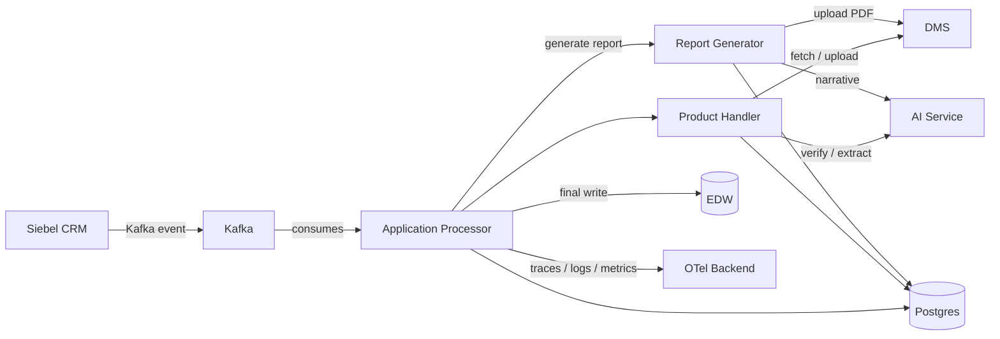
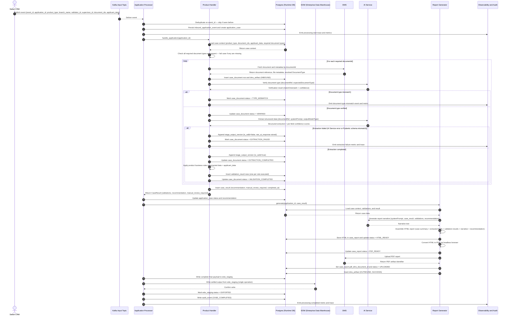
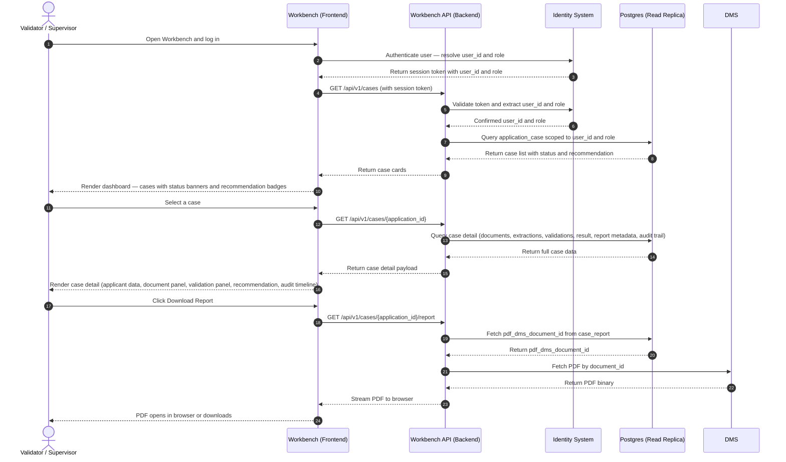

# AI Credit Underwriting Platform — System Design

---

## Business Case

Alinma Bank processes credit applications by assigning each case to a human Validator. Today, that Validator manually fetches supporting documents from the Document Management System (DMS), reads each one, extracts key data fields, cross-checks those fields against the applicant's CRM record, applies business rules, and writes a recommendation. This process is slow (multi-hour per case), inconsistent across validators, and leaves no structured audit trail beyond PDF printouts stored in Siebel CRM.

**Our solution eliminates the manual extraction and validation work.** When Siebel CRM submits a credit application, this platform:

1. Automatically fetches all required documents from DMS.
2. Verifies each document is visually what it claims to be (using AI).
3. Extracts structured data fields from each document (using AI).
4. Applies the product's business validation rules to the extracted data against the applicant's CRM records.
5. Generates a structured, human-readable PDF report summarising the case, all validations, and a system recommendation (APPROVE / HOLD / DECLINE).
6. Delivers the PDF back into DMS and the structured data into the Enterprise Data Warehouse (EDW), so the Validator receives a complete, ready-to-act case package.

The Validator's role shifts from manual data gathering to reviewing a pre-assembled report and acting on the recommendation. Processing time drops from hours to minutes. Every extraction, every validation result, and every system decision is stored immutably for compliance and audit.

---

## Part I — Architectural Decision Record (ADR)

> ADRs capture **why** the system is designed the way it is. They are the long-term rationale behind every major technical choice. Read this section before reading the implementation details in Part II.

---

### 1. Purpose and Context

This platform automates credit application processing at Alinma Bank. When Siebel CRM submits a credit application event to Kafka, the system:

1. Fetches the application documents from DMS.
2. Verifies each document matches its declared type (using AI).
3. Extracts structured data from each document (using AI).
4. Applies business validation rules to the extracted data and the applicant's `applicant_data`, and records the outcomes.
5. Generates a self-contained PDF report (narrative written by AI).
6. Delivers the PDF to DMS and structured data to EDW so a human Validator can review the report inside Siebel CRM.

The platform is built on four fixed pillars:

| Pillar | What it means |
|---|---|
| Fixed **product types** | A closed set of credit products (e.g. Personal Finance, Auto Finance). Each gets its own handler class. Adding a product requires only a new class — no other code changes. |
| Fixed **document types** | A closed set of document kinds (e.g. ID Document, Salary Certificate). Each gets its own Pydantic model defining the fields AI must extract. |
| **AI Service** as the unified service | One AI Service handles document verification, data extraction, and narrative report generation. This avoids managing multiple AI infrastructure components and standardises prompt engineering, model versioning, and monitoring under one service. |
| **Postgres + EDW** as the two databases | Postgres holds all runtime state, intermediate results, audit trail, and the EDW staging buffer. EDW is the company-wide Enterprise Data Warehouse and receives only the settled final output, written exactly once per case. |

---

### 2. Stakeholders

| Stakeholder | Role |
|---|---|
| **Siebel CRM** | Two interactions with this system: **(1) Event publisher** — triggers processing by publishing to Kafka with `applicant_data` and document identifiers. **(2) Output consumer** — reads the final PDF report from DMS and the structured case data from EDW once the pipeline completes. Siebel never calls this system's API and is never called by this system during processing. |
| **Kafka** | Event bus that buffers application-processing events and decouples Siebel CRM from pipeline latency. Events are durable and replayable. |
| **Application Processor** | Consumes Kafka events, creates the case in Postgres, invokes the product handler, receives the `CaseResult`, delegates report generation, and writes the final output to EDW. It coordinates the pipeline — it contains no business logic. |
| **Product Handler** | One class per `ProductType`. Owns the required document list, extraction routing, validation rules, and recommendation logic for that product. The Application Processor is unaware of product-specific rules. |
| **AI Service** | The single AI service for all AI tasks: document type verification, structured data extraction, and report narrative generation. All three calls use the same endpoint; the task is selected via the system prompt and expected output schema. |
| **Postgres** | Runtime database: job state, intermediate results, retries, audit trail, EDW staging buffer, HTML report storage. |
| **EDW** | Alinma's Enterprise Data Warehouse — an existing company-wide system. Receives the settled final output in a single write per case. EDW does not support mid-pipeline queries; all data is staged in Postgres first and written to EDW atomically at the end. |
| **DMS** | Document Management System. Source of application documents; destination for the final PDF report. |
| **Report Generator** | In-process service. Calls AI Service for narrative text, assembles the report in HTML (for full layout control), stores the HTML in Postgres, converts to PDF via headless browser, and writes the PDF to DMS. |
| **Observability and Audit** | All telemetry is to be emitted via the OpenTelemetry (OTel) SDK and exported to an OTel-compatible backend. The wrapping client lives in `src/creditunder/otel_observability.py` (class `Telemetry`) and exposes the standard span/counter/histogram surface. The class is currently scaffolding-only — it is not yet wired into the pipeline. Until then, runtime logging is handled by `structlog` (JSON to stdout + rotating file). Immutable business audit records are written to Postgres (`audit_event`) for long-term queryable history independent of the observability platform's retention window. |
| **Validator / Supervisor** | Human bank staff. Validators review cases assigned to them. Supervisors review all cases under their team. Both interact only through the internal UI (described in Section 12) and through Siebel CRM — they have no direct interaction with this system's API or database. |

---

### 3. Architectural Decisions

| Decision | Rationale |
|---|---|
| **Kafka-only event trigger** | Siebel CRM publishes to Kafka — no synchronous API can start processing. Provides durable, replayable delivery and decouples CRM from pipeline latency. If the processing system is down, events queue safely in Kafka with no data loss. |
| **AI Service as the unified service** | A single AI Service endpoint handles document verification, extraction, and narrative generation. This avoids managing multiple AI infrastructure components and standardises prompt engineering, model versioning, and monitoring under one service. |
| **Document type verification before extraction** | Before extracting data, AI Service confirms the document visually matches its declared type (e.g. the file labelled SALARY_CERTIFICATE is actually a salary certificate). This catches mismatched or corrupted uploads early — before they produce misleading extraction results. |
| **Product handler strategy pattern** | `ProductType` resolves to one handler class that owns all business rules for that product. The Application Processor only coordinates; adding a new product requires only a new class with no changes to the Application Processor or any other component. |
| **Async, idempotent, retryable stages** | All stages run asynchronously. Every stage boundary is idempotent on `application_id` + `event_id` + stage identity + version number. Retry attempts are persisted; terminal failures go to `dead_letter_event` with full payload for deterministic replay. |
| **Immutable versioned outputs** | Extraction and validation results are append-only versioned rows — never overwritten. This guarantees a complete, reproducible audit trail for compliance and diagnostics, and allows re-runs to be compared against prior runs. |
| **HTML-first report generation** | The report is assembled in HTML before being converted to PDF. HTML gives the Report Generator full control over layout: tables, conditional sections, colour coding, and structured visual hierarchy. Storing the HTML in Postgres allows report regeneration without re-running the full pipeline. |
| **Postgres + EDW dual-database strategy** | Postgres holds all runtime state and retries. EDW receives the settled final output in a **single write per case**, preceded by a staging write in Postgres. The staging row ensures no data loss if the EDW write is interrupted — the write retries from the staging row without re-running the pipeline. |
| **Dual handoff to Siebel via DMS and EDW** | Siebel CRM consumes two outputs: the PDF from DMS and the structured data from EDW. Handoff is only complete when both `pdf_dms_document_id` is non-null and `edw_staging.status` is `EXPORTED`. |
| **Self-contained processing event** | The Kafka event carries `applicant_data` alongside the document identifiers. Processing is fully self-contained once the event is consumed. A CRM outage cannot block in-flight applications. The trade-off is a larger event payload — CRM must include all fields needed for cross-checking at publish time. |

---

### 4. Explicit Assumptions

Every decision above relies on assumptions that are not derivable from the code alone. These are listed here so any reader unfamiliar with the project can understand what was taken as given.

| Assumption | Where it affects the design |
|---|---|
| AI Service is the only AI service available in this environment. No alternative AI provider is used. | All AI tasks (verification, extraction, narrative) go to one endpoint. No multi-provider routing is implemented. |
| AI Service supports structured output: given a system prompt and a Pydantic model schema, it returns a JSON response that can be validated against that schema. | Extraction uses typed Pydantic models. If AI Service cannot guarantee structured output, a parsing and fallback layer would be required. |
| DMS exposes document metadata including the `DocumentType` label set by the uploader. | The Product Handler uses this label as the `expectedDocumentType` in the AI verification call. If DMS does not expose this, the handler cannot determine which verification and extraction prompt to apply without an additional classification step. |
| DMS document identifiers are stable: a `documentId` that exists today will still exist and return the same document when retried minutes later. | Retry logic re-fetches documents by `documentId`. If DMS IDs are ephemeral or mutable, retries could fetch wrong documents. |
| EDW writes are idempotent: submitting the same `edw_staging` payload twice does not create duplicate records. | The EDW write is retried on failure from the staging row. If EDW is not idempotent, a duplicate-detection mechanism must be added at the EDW layer. |
| Kafka delivers messages at-least-once. Exactly-once delivery is not guaranteed. | The system deduplicates on `event_id` at consumption time. An event arriving twice is detected and the second occurrence is dropped before any processing begins. |
| The processing pipeline completes within 30 seconds for 95% of cases at a peak load of 300 events per hour during working hours. | End-to-end SLA and per-stage timing budgets are defined in Section 10.0. Timeout logic must be added per stage and surfaced in observability if the SLA target is not met. |
| `applicant_data` carried in the Kafka event is the authoritative version of the applicant's record at submission time. | The system never calls Siebel CRM after consuming the event. If CRM records change after submission, this system processes the snapshot at submission time — not the updated version. |
| The number of product types and document types is small and changes infrequently. | These are modelled in code, not in config tables. If the business requires non-developer-configurable product or document definitions, this design must be revised to support a database-driven configuration layer. |
| The internal UI (Section 12) is a read-only portal. No case actions (approve, reject, override) are taken through the UI — those happen in Siebel CRM. | The UI backend exposes read-only API endpoints. No write operations are needed on the UI path. |
| All external reference data required for validation — including SIMAH credit scores, SIMATI records, T24 account data, and any other bank-managed data source — is pre-fetched by Siebel CRM and included in `applicant_data` at event submission time. | The platform never calls external data providers directly. If a required field is absent from `applicant_data`, validation cannot run for that field. The Kafka event schema must be extended at source before new cross-check rules can be applied. |
| The AI Service is deployed within the bank's on-premises infrastructure boundary. No applicant data, document content, or extracted field values leaves the bank's network at any point in the pipeline. | There are no data-residency or data-exfiltration constraints on the AI integration under this assumption. If the AI deployment model changes to a cloud-hosted provider, a full data classification and privacy review must be completed before integration proceeds. |

---

## Part II — Engineering Design Record (EDR)

> EDRs describe **how** the system is built. This is the technical specification developers follow to implement and maintain the platform.

---

### 5. Input Event Contract

The Kafka message that starts processing must carry:

| Field | Type | Description |
|---|---|---|
| `event_id` | string (UUID) | Unique identifier for this event. Used for deduplication at consumption time — if the same `event_id` is seen twice, the second occurrence is dropped. |
| `application_id` | string | Business identifier for the credit application in Siebel CRM. |
| `product_type` | string | Value of the `ProductType` enum — used to resolve the product handler class. If the value does not match a registered handler, the event is rejected immediately and written to `dead_letter_event`. |
| `branch_name` | string | The name of the bank branch where the application was submitted. Stored for audit and reporting purposes only — not used in processing logic. |
| `validator_id` | string | The Siebel CRM user ID of the bank staff member submitting the application. Stored for ownership traceability and audit. This is the person who submitted the application in CRM, not necessarily the person who will review the final report. |
| `supervisor_id` | string | The Siebel CRM user ID of the supervisor of the submitting validator. Stored for ownership hierarchy and UI access control. |
| `document_ids` | array of string | List of DMS document identifiers to fetch and process. Each entry resolves to one document. The Product Handler determines which document types it requires; documents not required by the handler are silently ignored. |
| `applicant_data` | object | The applicant's records as held by Siebel CRM at submission time, including all fields pre-fetched from external systems (e.g. SIMAH score, SIMATI data, T24 account details, name, ID number, date of birth, employer, salary). Carried in the event so the system can cross-check extracted document fields without ever calling any external system directly. |

**Example event payload:**

```json
{
  "event_id": "f7c3a1b2-4d5e-4a6f-8b9c-0d1e2f3a4b5c",
  "application_id": "APP-2026-089341",
  "product_type": "PERSONAL_FINANCE",
  "branch_name": "Riyadh Main Branch",
  "validator_id": "CRM-USR-4821",
  "supervisor_id": "CRM-USR-1093",
  "document_ids": ["DMS-00192", "DMS-00193"],
  "applicant_data": {
    "name": "Mohammed Al-Harbi",
    "id_number": "1082345678",
    "date_of_birth": "1985-04-12",
    "employer": "Saudi Aramco",
    "declared_salary": 18500.00,
    "simah_score": 720,
    "t24_account_id": "T24-ACC-998821"
  }
}
```

> **To be confirmed with infrastructure team before implementation:** Kafka message key (recommended: `application_id` for partition locality), correlation ID header for distributed tracing, and event schema version field for forward compatibility.

> **To be confirmed with DMS integration team before implementation:** The mechanism by which `DocumentType` is resolved for each `document_id`. The system assumes DMS metadata includes the uploader-assigned document type label. If it does not, an additional classification step is required before verification can begin.

---

### 6. Code Model

Product and document behaviour is modelled in code — not in the database. Each product type has a dedicated handler class; each document type has a dedicated Pydantic model.

#### 6.1 Product types

```python
class ProductType(str, Enum):
    # To support a new credit product, add an entry here and create a new handler class.
    # No other file needs to change.
    PERSONAL_FINANCE = "PERSONAL_FINANCE"
    AUTO_FINANCE = "AUTO_FINANCE"


class BaseProductHandler(ABC):
    product_type: ProductType  # declares which product this handler owns

    @property
    @abstractmethod
    def required_documents(self) -> set[DocumentType]:
        # Each handler declares the document types it needs.
        # The Application Processor uses this list to check completeness before starting.
        raise NotImplementedError

    @abstractmethod
    def handle_application(self, application_id: str) -> "CaseResult":
        """
        Single entry point for processing one application.

        For each document this handler requires, it:
          1. Fetches the document from DMS
          2. Calls AI Service to verify the document type matches what is expected
          3. Calls AI Service to extract structured data into the typed Pydantic model
          4. Applies product-specific business rules to the extracted data and applicant_data

        Aggregates all document-level outcomes into a CaseResult and returns it.
        The Application Processor never iterates documents and never calls AI Service
        directly — that is the handler's responsibility.
        """
        raise NotImplementedError
```

#### 6.2 Document types

```python
class DocumentType(str, Enum):
    # Each entry maps to exactly one Pydantic model below.
    # AI Service uses the document type to select the right verification and extraction prompt.
    ID_DOCUMENT = "ID_DOCUMENT"
    SALARY_CERTIFICATE = "SALARY_CERTIFICATE"


class IdDocumentModel(BaseModel):
    id_number: ExtractedField[str]
    customer_name: ExtractedField[str]
    date_of_birth: ExtractedField[date | None]


class SalaryCertificateModel(BaseModel):
    employee_name: ExtractedField[str]
    employer_name: ExtractedField[str]
    basic_salary: ExtractedField[Decimal | None]
    net_salary: ExtractedField[Decimal | None]
```

#### 6.2.1 Extracted field metadata

Every field extracted from a document is wrapped in `ExtractedField[T]`. This wrapper carries the metadata required for validation routing, audit, and report generation:

```python
class ExtractedField[T](BaseModel):
    value: T                        # The extracted value
    confidence: float               # AI confidence score (0.0–1.0)
    source_document_name: str       # Document filename from which this field was extracted
    page_reference: int             # Page number in the source document (1-indexed)
    normalized_label: str           # Canonical label used for display and validation routing
```

The wrapper ensures every extracted value is paired with its confidence score and source context. Validators access `field.value` directly; the wrapper metadata supports audit, human review, and LOW_CONFIDENCE rule triggering.

#### 6.3 Code ownership boundaries

The following concerns are owned by code, not the database. They must not be stored in config tables — they are part of the application's business logic and must be reviewed and tested as code:

- Document type definitions and their Pydantic extraction models.
- Product-to-document requirement definitions (`required_documents` per handler).
- Extraction schema routing by document type (which Pydantic model AI Service populates).
- Business validation rules applied by each product handler.
- `rule_code` string identifiers (e.g. `SALARY_EMPLOYER_MATCH`, `ID_NAME_CHECK`) — defined and owned by each handler class. The logic behind each code is inseparable from the handler that executes it.

#### 6.4 Case result contract

The product handler returns a single `CaseResult` to the Application Processor. This object contains everything the Report Generator needs to render the report and everything the EDW write needs to deliver the final output.

```python
class Recommendation(str, Enum):
    APPROVE = "APPROVE"
    HOLD = "HOLD"
    DECLINE = "DECLINE"


class ValidationOutcome(str, Enum):
    # Every check must map to exactly one of these four categories.
    # Ops prioritises review: hard breaches first, then soft mismatches,
    # then low-confidence extractions, then manual-review items.
    HARD_BREACH = "HARD_BREACH"                         # blocking rule failure
    SOFT_MISMATCH = "SOFT_MISMATCH"                     # non-blocking discrepancy vs. CRM values
    LOW_CONFIDENCE = "LOW_CONFIDENCE"                   # AI confidence below threshold
    MANUAL_REVIEW_REQUIRED = "MANUAL_REVIEW_REQUIRED"   # cannot be automated in MVP


class ValidationResult(BaseModel):
    rule_code: str                  # product-defined identifier (e.g. "SALARY_EMPLOYER_MATCH")
    input_data: dict[str, object]   # data the rule consumed — from extracted fields and/or applicant_data
    outcome: ValidationOutcome
    details: dict[str, object]      # rule-specific output (reason, expected vs. actual, failing condition)
    confidence: float | None = None # AI confidence score, if the rule depends on an extraction result
    manual_review_required: bool = False


class CaseResult(BaseModel):
    application_id: str
    product_type: ProductType
    validations: list[ValidationResult]
    recommendation: Recommendation
    manual_review_required: bool = False
    completed_at: datetime
```

> **To be confirmed with BRD:** The exact fields, recommendation thresholds, and validation rules that drive `Recommendation` and `ValidationOutcome` must be reviewed and aligned with the Business Requirements Document before implementation.

---

### 7. AI Service Integration

AI Service is called at three distinct points in the pipeline. All three calls go to the same endpoint; the task is selected via the system prompt and the expected output schema.

| Caller | Purpose | Input | Output |
|---|---|---|---|
| **Product Handler** (verification) | Confirm the document visually matches its declared `DocumentType`. Catches mismatched or corrupted uploads before they produce misleading extraction results. | Document reference + expected document type | Verification result: match / mismatch + confidence score |
| **Product Handler** (extraction) | Extract structured data from the document into the typed Pydantic model for that document type. | Document reference + system prompt + target output model schema | Validated structured extraction + per-field confidence scores |
| **Report Generator** | Generate a human-readable narrative summarising the case outcome for the Validator. | System prompt + `CaseResult` + validations + recommendation | Narrative text: recommendation summary, validation explanations, reviewer notes |

---

### 8. Database Schema

All runtime state is held in Postgres. The schema is designed for idempotent retries and a complete audit trail.

**Append-only tables.** `stage_output_version` and `validation_result` are strictly append-only: a new row is always written for each attempt or rule execution; no row is ever updated or deleted. These tables form the immutable audit backbone of every case.

**Status-tracking tables.** `application_case`, `case_document`, `case_report`, `edw_staging`, and `processing_job` use in-place status updates. Each status column advances through a monotonic, forward-only state machine — no status can revert to a prior state. This is a deliberate trade-off: append-only history for outputs, mutable state for lifecycle tracking.

#### Tables

**`inbound_application_event`** — One row per Kafka event received. Used for deduplication.

> **FK note:** `application_case.event_id` references `inbound_application_event.event_id` (the business deduplication key, declared UNIQUE), not `inbound_application_event.id` (the surrogate PK). This makes event tracing natural without a join on the surrogate key.

| Column | Type | Notes |
|---|---|---|
| `id` | UUID PK | |
| `event_id` | UUID UNIQUE NOT NULL | Deduplication key — checked at consumption time |
| `application_id` | string NOT NULL | Business key from CRM |
| `product_type` | string | Resolved from the event payload at ingest |
| `raw_payload` | JSONB NOT NULL | Full Kafka message stored for replay |
| `received_at` | timestamptz NOT NULL | |
| `status` | string NOT NULL | `RECEIVED` (default) → `PROCESSING` → `COMPLETED` / `FAILED` |
| `updated_at` | timestamptz NOT NULL | Last status transition timestamp |

---

**`application_case`** — One row per application being processed. Tracks the top-level case state.

> **Resubmission note:** The UNIQUE constraint on `application_id` is intentional. A second event carrying a new `event_id` but the same `application_id` triggers the business/contract failure path in Section 11.2 and never creates a second case row. This constraint must remain until the business formally defines a resubmission policy.

> **`manual_review_required` vs `MANUAL_INTERVENTION_REQUIRED` status:** These serve distinct purposes. The boolean is set immediately when the handler returns and drives the Workbench priority banner — it means the system made a recommendation but flagged at least one rule for human review. The `MANUAL_INTERVENTION_REQUIRED` status means the pipeline itself could not complete without human action (e.g., missing documents after retry exhaustion). A case can have `manual_review_required = true` and `status = COMPLETED` simultaneously.

| Column | Type | Notes |
|---|---|---|
| `id` | UUID PK | |
| `application_id` | string UNIQUE NOT NULL | |
| `event_id` | UUID NOT NULL FK → `inbound_application_event.event_id` | Enforced via `fk_application_case_event_id` |
| `product_type` | string NOT NULL | |
| `branch_name` | string NOT NULL | |
| `validator_id` | string NOT NULL | |
| `supervisor_id` | string NOT NULL | |
| `applicant_data` | JSONB NOT NULL | Snapshot from the Kafka event — authoritative for this case |
| `status` | string NOT NULL | `CREATED` → `IN_PROGRESS` → `COMPLETED` (or `FAILED` / `MANUAL_INTERVENTION_REQUIRED`). `COMPLETED` means business processing produced a recommendation; delivery state lives on `case_report` and `edw_staging` |
| `recommendation` | string | `APPROVE`, `HOLD`, `DECLINE` — set after handler completes |
| `recommendation_rationale` | text | Free-form rationale string emitted alongside the recommendation |
| `manual_review_required` | boolean NOT NULL DEFAULT false | |
| `error_detail` | text | Top-level pipeline failure description. Set whenever `status` is `FAILED` or `MANUAL_INTERVENTION_REQUIRED`. Never silently null on failure — every error path captures here |
| `created_at` | timestamptz NOT NULL | |
| `updated_at` | timestamptz NOT NULL | Last status transition timestamp |
| `completed_at` | timestamptz | Set only when **both** the report has been uploaded to DMS **and** the EDW write has been confirmed. Stays NULL if either delivery side fails — the failure is captured on the relevant child row (`case_report.error_detail` / `edw_staging.export_error`) for independent retry |

---

**`case_document`** — One row per document within a case. Tracks verification and extraction state per document.

| Column | Type | Notes |
|---|---|---|
| `id` | UUID PK | |
| `case_id` | UUID NOT NULL FK → `application_case` | |
| `dms_document_id` | string NOT NULL | Source identifier in DMS |
| `document_type` | string | Resolved from DMS metadata once the fetch succeeds |
| `document_name` | string | Filename as reported by DMS |
| `status` | string NOT NULL | `PENDING` → `FETCHED` → `VERIFIED` / `TYPE_MISMATCH` / `VERIFICATION_FAILED` → `EXTRACTED` / `EXTRACTION_FAILED` → `VALIDATION_COMPLETED` |
| `verification_result` | string | `MATCH`, `MISMATCH` |
| `verification_confidence` | float | AI confidence on the type verification call |
| `fetched_at` | timestamptz | |
| `verified_at` | timestamptz | |
| `error_detail` | text | DMS or AI failure description. Set on any `*_FAILED` status; never silent |
| `updated_at` | timestamptz NOT NULL | Last status transition timestamp |

---

**`stage_output_version`** — Append-only extraction versions. A new row is written for each extraction attempt. Never updated.

| Column | Type | Notes |
|---|---|---|
| `id` | UUID PK | |
| `case_document_id` | UUID NOT NULL FK → `case_document` | |
| `version` | integer NOT NULL | Monotonically increasing per document |
| `raw_extraction` | JSONB NOT NULL | Full typed extraction result (all `ExtractedField` wrappers serialised) |
| `is_valid` | boolean NOT NULL | False if Pydantic schema validation failed |
| `validation_error` | text | Schema validation error message if `is_valid = false` |
| `raw_ai_response` | JSONB | Raw AI Service response — retained for diagnostics |
| `extracted_at` | timestamptz NOT NULL | |

---

**`validation_result`** — One row per business rule executed, per case. Append-only.

| Column | Type | Notes |
|---|---|---|
| `id` | UUID PK | |
| `case_id` | UUID NOT NULL FK → `application_case` | |
| `rule_code` | string NOT NULL | Identifies the business rule (e.g. `SALARY_EMPLOYER_MATCH`) |
| `outcome` | string NOT NULL | `HARD_BREACH`, `SOFT_MISMATCH`, `LOW_CONFIDENCE`, `MANUAL_REVIEW_REQUIRED` |
| `description` | text NOT NULL | Human-readable explanation of the outcome (rendered in the report) |
| `field_name` | string | Field the rule operated on, when applicable |
| `extracted_value` | text | Value pulled from the document |
| `expected_value` | text | Value the rule expected (e.g. CRM record) |
| `confidence` | float | AI confidence, if applicable |
| `manual_review_required` | boolean NOT NULL DEFAULT false | |
| `evaluated_at` | timestamptz NOT NULL | |

---

**`case_result`** — The aggregated handler output. One row per completed case.

> **`completed_at` semantics:** `case_result.completed_at` records when the product handler finished (business processing time). `application_case.completed_at` records when the full pipeline — including report upload and EDW write — completed (delivery time). Both are retained for separate operational and business reporting purposes.

| Column | Type | Notes |
|---|---|---|
| `id` | UUID PK | |
| `case_id` | UUID UNIQUE NOT NULL FK → `application_case` | |
| `recommendation` | string NOT NULL | |
| `manual_review_required` | boolean NOT NULL | |
| `completed_at` | timestamptz NOT NULL | Handler completion time — see semantics note above |

---

**`case_report`** — Report generation output. One row per case, updated as report stages complete.

| Column | Type | Notes |
|---|---|---|
| `id` | UUID PK | |
| `case_id` | UUID UNIQUE NOT NULL FK → `application_case` | |
| `html_content` | text | Full assembled HTML report — stored for regeneration without re-running the pipeline |
| `narrative` | text | The AI-generated narrative text |
| `pdf_dms_document_id` | string | DMS identifier of the uploaded PDF — null until upload is confirmed |
| `html_generated_at` | timestamptz | |
| `pdf_generated_at` | timestamptz | |
| `pdf_uploaded_at` | timestamptz | |
| `status` | string NOT NULL | `PENDING` → `HTML_READY` → `PDF_READY` → `UPLOADED`. Any failure (generation or DMS upload) sets `FAILED` with `error_detail` populated |
| `error_detail` | text | Description of the failure if `status = FAILED`. Cleared on successful re-upload |
| `updated_at` | timestamptz NOT NULL | Last status transition timestamp |

---

**`dms_artifact`** — Tracks every DMS interaction (both fetched documents and uploaded PDFs).

| Column | Type | Notes |
|---|---|---|
| `id` | UUID PK | |
| `case_id` | UUID NOT NULL FK → `application_case` | |
| `dms_document_id` | string NOT NULL | |
| `artifact_type` | string NOT NULL | `SOURCE_DOCUMENT`, `PDF_REPORT` |
| `direction` | string NOT NULL | `INBOUND` (fetched), `OUTBOUND` (uploaded) |
| `status` | string NOT NULL | `SUCCESS`, `FAILED` |
| `error_details` | JSONB | |
| `interacted_at` | timestamptz NOT NULL | |

---

**`processing_job`** — Tracks retryable job execution. One row per job attempt lifecycle.

| Column | Type | Notes |
|---|---|---|
| `id` | UUID PK | |
| `case_id` | UUID NOT NULL FK → `application_case` | |
| `job_type` | string NOT NULL | `DOCUMENT_FETCH`, `VERIFY_AND_EXTRACT`, `REPORT_GENERATION`, `REPORT_UPLOAD`, `EDW_WRITE` (verification + extraction share one AI call, so they share one job row) |
| `status` | string NOT NULL | `PENDING`, `IN_PROGRESS`, `COMPLETED`, `FAILED`, `RETRYING` |
| `attempt_count` | integer NOT NULL DEFAULT 0 | |
| `max_attempts` | integer NOT NULL | |
| `last_error` | text | |
| `last_attempted_at` | timestamptz | |
| `completed_at` | timestamptz | |
| `updated_at` | timestamptz NOT NULL | Last status transition timestamp |

---

**`dead_letter_event`** — Terminal failures. Events that have exhausted retries or are invalid.

| Column | Type | Notes |
|---|---|---|
| `id` | UUID PK | |
| `event_id` | UUID | FK → `inbound_application_event.event_id` (UNIQUE column). NULLable: events that fail schema validation never produce an inbound row |
| `case_id` | UUID | FK → `application_case.id` if a case was created before failure |
| `application_id` | string | Business key, when known |
| `reason_code` | string NOT NULL | e.g. `MAX_RETRIES_EXCEEDED`, `INVALID_EVENT_SCHEMA`, `UNSUPPORTED_PRODUCT_TYPE`, `MISSING_REQUIRED_DOCUMENTS`, `UNHANDLED_PIPELINE_EXCEPTION` |
| `error_detail` | text | Human-readable failure description |
| `raw_payload` | JSONB | Full original payload for deterministic replay |
| `stack_trace` | text | If caused by an unhandled exception |
| `created_at` | timestamptz NOT NULL | |
| `replayed_at` | timestamptz | Set when a human operator replays the event |

---

**`edw_staging`** — Complete final payload buffered before the EDW write.

| Column | Type | Notes |
|---|---|---|
| `id` | UUID PK | |
| `case_id` | UUID UNIQUE NOT NULL FK → `application_case` | |
| `payload` | JSONB NOT NULL | Complete final output: extracted data + validations + report metadata |
| `status` | string NOT NULL | `STAGED` (default) → `EXPORTED` / `EXPORT_FAILED`. `EXPORT_FAILED` rows are retried independently of the pipeline since `payload` already contains the settled output |
| `edw_confirmation_id` | string | Identifier returned by EDW on a successful write |
| `staged_at` | timestamptz NOT NULL | |
| `exported_at` | timestamptz | |
| `export_error` | text | Failure description from the most recent EDW write attempt |
| `updated_at` | timestamptz NOT NULL | Last status transition timestamp |

---

**`audit_event`** — Immutable audit log. One row per business-significant action. Never deleted or updated.

| Column | Type | Notes |
|---|---|---|
| `id` | UUID — part of composite PK with `occurred_at` | |
| `occurred_at` | timestamptz NOT NULL — part of composite PK; partition key | |
| `case_id` | UUID FK → `application_case` | |
| `application_id` | string | Business key, denormalised for cross-case queries |
| `event_type` | string NOT NULL | `CASE_CREATED`, `DOCUMENT_FETCHED`, `EXTRACTION_COMPLETED`, `DOCUMENT_TYPE_MISMATCH`, `VALIDATION_COMPLETED`, `REPORT_UPLOADED`, `EDW_EXPORTED`, `CASE_COMPLETED`, `MISSING_REQUIRED_DOCUMENTS`, `CASE_FAILED` |
| `actor` | string | System component that generated this event |
| `detail` | JSONB | Event-specific data |

---

#### 8.1 Recommended Indexes

The following indexes are required for the query patterns in the processing pipeline and the Workbench API. Queries on large tables without these indexes will degrade non-linearly as case volume grows.

| Table | Index | Justification |
|---|---|---|
| `inbound_application_event` | UNIQUE on `event_id` | Primary deduplication gate at event consumption. |
| `application_case` | UNIQUE on `application_id` | Business key lookup; resubmission conflict detection. |
| `application_case` | Index on `validator_id` | Workbench: load all cases for a Validator at login. |
| `application_case` | Index on `supervisor_id` | Workbench: load all cases for a Supervisor's team. |
| `application_case` | Index on `(status, created_at DESC)` | Workbench: dashboard filter by status, sorted by submission date. |
| `case_document` | Index on `case_id` | Pipeline: load all documents for a case in one query. |
| `stage_output_version` | Index on `(case_document_id, version DESC)` | Pipeline: fetch the latest extraction version per document. |
| `validation_result` | Index on `(case_id, outcome)` | Workbench: validation panel grouped by outcome. |
| `audit_event` | Index on `(case_id, occurred_at ASC)` | Workbench: chronological audit timeline per case. |
| `processing_job` | Index on `(case_id, job_type, status)` | Pipeline: check job state before retrying. |
| `dead_letter_event` | Index on `source_event_id` | Ops: trace from an inbound event to its dead-letter entry. |

#### 8.2 Partitioning

`audit_event` grows without bound — one or more rows per stage per case. At 300 events/hour × 8 working hours × ~15 audit rows per case, this table will accumulate approximately **36,000 rows per working day**. The table is **monthly RANGE-partitioned on `occurred_at`** (PostgreSQL native partitioning). Implementation details:

- The primary key is composite (`id`, `occurred_at`) so the partition key can participate in the PK as required by PostgreSQL.
- The migration creates partitions covering 2026-01 through ~18 months past the migration date and a `audit_event_default` catch-all so a missing future partition never silently drops audit rows.
- Indexes (`ix_audit_event_case_id`, `ix_audit_event_occurred_at`, `ix_audit_event_case_time`) are declared on the parent table; PostgreSQL propagates them to all current and future partitions.
- A scheduled maintenance job (e.g. `pg_partman` or a cron task) must extend the partition window before the last explicit partition fills.

---

### 9. End-To-End Sequence

#### Component Overview



#### Detailed Sequence



---

### 10. Non-Functional Requirements

#### 10.0 Throughput and Latency Targets

| Metric | Target |
|---|---|
| **Peak event volume** | 300 events per hour during working hours |
| **End-to-end SLA** | Case processing completed within **30 seconds** from event consumption to EDW write confirmation (95th percentile) |
| **AI Service budget** | All AI Service calls (verification + extraction + narrative) must complete within the 30-second SLA envelope. AI Service is the fixed bottleneck — monitor per-call latency and queue depth as the primary capacity signals (see Section 10.1). |

These targets drive the horizontal scaling model in Section 10.1 and inform the per-stage timeout thresholds that must be added when timeout logic is implemented.

#### 10.1 Horizontal Scaling

The Application Processor is the primary scaling unit. Multiple instances run in parallel, each consuming from the same Kafka consumer group — Kafka distributes partitions across instances so that each application is processed by exactly one worker at a time. Adding instances increases throughput linearly with the number of Kafka partitions. The product handlers run in-process with the Application Processor and scale with it automatically. Postgres handles concurrent writes safely via row-level locking and idempotency checks on `application_id`. The database connection pool size must be configured per instance to avoid exhausting Postgres connections as the instance count grows.

AI Service is the fixed external bottleneck. All AI calls — verification, extraction, and narrative generation — go through a single AI Service deployment. If throughput demand grows, AI Service instances can be placed behind an HTTP load balancer; the Application Processor's AI client URL points to the load balancer, and the change is transparent to application code. The key operational metric to monitor is the AI Service request queue depth and per-call latency — these are the first signals that AI Service capacity must scale.

#### 10.2 Document Handling at Scale

Documents are fetched from DMS into memory for verification and extraction, then discarded — they are not persisted to local disk or our own storage. Extraction results (structured JSON fields) and the HTML report are stored in Postgres, which is adequate for the expected data volumes per case. The PDF report is stored in DMS (the bank's existing document store), not in our database.

If document volume grows significantly (large files, high concurrency), fetching documents into application memory becomes a bottleneck. The mitigation strategy at that point is to introduce an object storage layer (e.g. an S3-compatible store): documents are written to object storage on first fetch, and subsequent steps reference the object store URL rather than re-fetching from DMS. This also allows the AI Service extraction step to consume documents directly from the store without passing them through the Application Processor's memory. This is not implemented in the MVP — it is the first scaling lever to pull if DMS fetch latency or memory pressure becomes a problem.

#### 10.3 Structured Logging and Observability

All telemetry — logs, traces, and metrics — is emitted using the **OpenTelemetry (OTel)** SDK and exported to an OTel-compatible backend (e.g. Grafana, Jaeger, Elastic, or any OTLP-compliant collector). OTel is the single instrumentation standard across the entire platform; no vendor-specific SDK is used directly in application code. This ensures the observability stack can be swapped without touching application logic.

**Logs** are emitted in JSON format over the OTel Logs signal (OTLP). Every log entry carries the following standard attributes: `application_id`, `event_id`, `trace_id` (auto-propagated by the OTel SDK for distributed trace correlation), `span_id`, `component` (e.g. `application_processor`, `product_handler.personal_finance`, `report_generator`), `log_level`, `timestamp`, and `message`. Structured key-value attributes — not embedded strings — are used for all queryable fields so the operations team can filter across all cases by `rule_code`, `document_type`, `recommendation`, or any other field without full-text parsing.

**Traces** use OTel distributed tracing. A root span is created when an event is consumed from Kafka and propagated through every downstream call: DMS fetch, AI Service verification, AI Service extraction, validation, report generation, and EDW write. Each stage runs as a child span. This gives a complete latency breakdown per case and allows pinpointing exactly which stage is slow or failing.

**Metrics** are emitted as OTel metrics (counters and histograms): events consumed, cases created, documents verified per outcome (match/mismatch), extractions per outcome (success/failed), validation outcomes by rule code, report upload success/failure, EDW write success/failure, and end-to-end pipeline duration. These metrics are the primary signal for the scaling decisions described in Section 10.1.

Log levels follow a consistent policy: `DEBUG` for per-field extraction values and internal state transitions (development and troubleshooting only); `INFO` for normal pipeline milestones (case started, document fetched, stage completed, case closed); `WARN` for degraded but non-blocking conditions (low-confidence extraction above threshold, soft mismatches, retries in progress); `ERROR` for failures that block a stage (AI Service error, DMS unavailable, Pydantic schema mismatch, EDW write failure).

Business-significant events (case created, document verified, extraction completed, report uploaded, EDW exported) are additionally written as `audit_event` rows in Postgres. This provides an immutable, queryable audit history that is independent of the observability platform and survives log retention windows.

#### 10.4 Non-Error Points of Failure

Several failure modes in this system produce no error — they produce a technically valid but operationally wrong outcome. These are harder to detect than exceptions and require explicit monitoring.

**Silent AI confidence drift.** AI Service may extract a value with confidence 0.72 when the threshold for `LOW_CONFIDENCE` is 0.70. The extraction is accepted and the validation passes, but the value is near the boundary. If AI Service's confidence calibration degrades over time (e.g. after a model update), a growing proportion of cases may pass with near-threshold confidence without triggering any alert. Mitigation: track the distribution of confidence scores per document type over time in observability; alert if the mean drops or the low-tail grows.

**EDW write confirmed but schema mismatch accepted silently.** If the EDW write API returns HTTP 200 but silently truncates or coerces fields that do not match its internal schema, the `edw_staging` row is marked `EXPORTED` but the data in EDW is wrong. Mitigation: confirm with the EDW team that the write API returns a schema validation error on mismatch — do not assume a 200 response means the data was accepted correctly.

**DMS serving a stale cached version.** DMS may cache documents and return a stale version for a given `documentId` if the document was recently updated in CRM before submission. The system processes the cached version without error, but the extracted data does not reflect the latest document. Mitigation: confirm with the DMS team whether document updates invalidate the cache, and whether the document fetch API supports cache-busting.

**Identical `application_id`, different `event_id`.** A CRM retry after a timeout sends a new event with a new `event_id` for an application already in progress or completed. The deduplication check on `event_id` passes (new event), but processing a second time for the same `application_id` creates a conflict. The system does not silently overwrite the first case, but without a clear business rule for this scenario it cannot determine whether to reject or reprocess. Mitigation: the business must define what constitutes a legitimate resubmission versus a CRM retry — see Section 11.2.

---

### 11. Failure Handling

Failures are grouped into three categories: external (DMS, AI Service, Kafka, EDW), business/contract, and internal. All failures are logged with structured fields and written to `audit_event`. Terminal failures go to `dead_letter_event`.

**Terminal-state guarantee.** No error is ever silently swallowed or replaced with a default value. Every failure path captures the error in the most specific `error_detail` column available so the disrupted state is visible to ops:

- Pipeline-level / unhandled exceptions → `application_case.status = FAILED`, `application_case.error_detail` set, plus `dead_letter_event` row with full stack trace.
- Missing required documents → `application_case.status = MANUAL_INTERVENTION_REQUIRED`, `application_case.error_detail` set, plus `dead_letter_event` row.
- Per-document failures (DMS fetch, AI verify+extract, unknown document type) → `case_document.status = *_FAILED`, `case_document.error_detail` set; the case continues with whatever documents succeeded so the handler can emit an explicit HARD_BREACH for the missing input rather than the case silently passing.
- Report generation or upload failure → `case_report.status = FAILED`, `case_report.error_detail` set. `application_case.status` stays `COMPLETED` because business processing is done; `application_case.completed_at` stays NULL until the report is uploaded.
- EDW export failure → `edw_staging.status = EXPORT_FAILED`, `edw_staging.export_error` set. `application_case.completed_at` stays NULL until the export retry succeeds against the persisted staging payload.

`application_case.completed_at` is set **only** when both delivery sides (report uploaded, EDW exported) have succeeded. A NULL `completed_at` on a `COMPLETED` case is the unambiguous signal that something downstream is unresolved — the specific failure is on the relevant child row.

---

#### 11.1 External system failures

> The behaviours below are the default design intent. All items require confirmation with the owning team before implementation.

**DMS.** Unavailability or timeout: exponential backoff retry, each attempt recorded in `processing_job`. On exhaustion: case moved to `dead_letter_event`, flagged for manual intervention. Document-not-found: stage marked failed; whether to retry (document temporarily unavailable) or fail permanently must be confirmed with the DMS team. PDF upload failure: `pdf_dms_document_id` left null, report job marked retryable, retry from stored HTML — no pipeline re-run needed. Whether repeated uploads with the same document identifier are idempotent must be confirmed with the DMS team.

**AI Service.** Service error or timeout: exponential backoff retry. Pydantic schema mismatch on extraction response: raw response and validation error persisted, stage marked retryable. If all retries fail: `dead_letter_event`, manual intervention flagged.

**Kafka.** Broker unavailable: consumer group pauses, events remain durable in the topic, processing resumes automatically on reconnection. Invalid event (missing fields, unrecognised `productType`, unsupported schema version): rejected immediately at consumption, raw payload written to `dead_letter_event`, no case created. Duplicate event (`event_id` already in `inbound_application_event`): dropped before any processing begins.

**EDW.** Write failure: `edw_staging` row remains intact, retried independently without re-running the pipeline. Schema rejection: `edw_staging` marked `EXPORT_FAILED`, surfaced via observability, manual correction required before retry. The EDW team must confirm idempotency guarantees and error response format.

---

#### 11.2 Business / event contract failures

**Same `application_id`, new `event_id`.** The system cannot determine whether this is a CRM retry or a deliberate resubmission. It must never silently overwrite a completed case. The business must define what constitutes a legitimate resubmission and whether it must carry a distinct event type or version flag.

**Unsupported `product_type`.** Rejected at consumption, written to `dead_letter_event` with reason code `UNSUPPORTED_PRODUCT_TYPE`. Supporting a new product type requires only a new handler class — no other component changes.

---

#### 11.3 Internal system failures

**Postgres connection failure.** Retry with backoff. On persistent failure: current job marked failed, surfaced via observability, worker continues serving other jobs — it does not crash.

**Worker crash mid-job.** Job remains `IN_PROGRESS` in `processing_job`. A watchdog timeout detects the stalled job, marks it `FAILED`, and re-queues it. Because every stage is idempotent, the re-queued job checks whether output was already written before doing any work — no double-processing.

**Unhandled exception in product handler.** Caught at the Application Processor boundary. Job marked failed; full stack trace written to `dead_letter_event.payload_json` for diagnosis and replay.

**Max retries exceeded.** Job moved to `dead_letter_event` with reason code and last error details. Case flagged for manual intervention. Alert raised. Dead letter events are not retried automatically — manual investigation required before replay.

**Missing required documents.** Handler fails the case at the completeness check, persists the list of missing document types, and does not proceed. Case remains in `FAILED` status until missing documents are provided and the case is replayed.

**Partial document success.** Completed extractions and validations are persisted. Failed documents remain in a retryable state. Case stays open until all required documents are resolved.

**Report HTML assembly failure.** `case_report.status = FAILED` with `error_detail` populated. Case retains its terminal business status (`COMPLETED`) and recommendation. `application_case.completed_at` stays NULL until the report is regenerated and uploaded.

**PDF conversion failure.** HTML is already safely in Postgres. `pdf_dms_document_id` left null, `case_report.status = FAILED` with `error_detail` populated. PDF conversion can be retried from stored HTML — no pipeline re-run.

---

### 12. Validator Workbench — Output Delivery Options

Once the pipeline completes, the Validator and Supervisor need to access the case results and the PDF report. There are two architectural options for how this is delivered. **One must be chosen before implementation.** Both are described below with their tradeoffs.

---

#### Option A — EDW-only delivery (CRM-native, no internal UI)

In this option, the platform's only outputs are the PDF uploaded to DMS and the structured case data written to EDW. Siebel CRM reads both natively: the PDF appears in the document viewer inside the CRM case record, and the structured data is surfaced through CRM's existing EDW integration.

**How it works:**
- The pipeline completes and writes the PDF to DMS and the full case payload to EDW.
- The Validator opens the application in Siebel CRM and sees the PDF report as an attached document — no additional system is needed.
- The Supervisor monitors cases through CRM's existing team views, filtered by their subordinates.
- No internal UI is built or maintained by this team.

**Advantages:**
- Zero UI development effort. The team owns only the processing pipeline.
- Validators and Supervisors work entirely within their existing CRM workflow — no new tool to learn.
- No additional authentication layer, no frontend infrastructure to operate.

**Disadvantages:**
- The display of case data (validations, recommendation, document breakdown) is controlled by the CRM team, not this team. Layout and detail level depend on what CRM can render from EDW.
- Real-time pipeline status (IN_PROGRESS, FAILED, retrying) is not visible to Validators unless CRM exposes EDW status fields — which may not be the case.
- No way to surface MANUAL_INTERVENTION_REQUIRED cases proactively; Validators must poll CRM.
- Any change to what Validators see requires CRM-side work, not this team's work.

**Assumption for this option:** The CRM team has an active EDW integration that can surface the structured case payload fields in the CRM UI, and they are willing to build or extend it for this use case. This must be confirmed before choosing Option A.

---

#### Option B — Internal Validator Workbench (custom UI owned by this team)

In this option, this team builds and operates a dedicated internal web application — the **Validator Workbench** — that Validators and Supervisors use instead of (or alongside) Siebel CRM for reviewing AI-processed cases. The workbench reads directly from Postgres and streams the PDF from DMS.

**How it works:**
- The pipeline completes and writes results to Postgres (as it always does). The PDF is in DMS.
- The Validator logs into the Workbench. At login, the system fetches all cases assigned to them and displays them as a dashboard.
- The Supervisor logs in and sees all cases for every Validator under them.
- The Validator selects a case to open the detail view, reviews all information, and downloads the PDF report.
- No case actions (approve, reject, override) are taken in the Workbench — those remain in Siebel CRM. The Workbench is read-only.

**Advantages:**
- Full control over what Validators see: real-time pipeline status, validation breakdowns, confidence scores, manual-review flags.
- Can surface MANUAL_INTERVENTION_REQUIRED cases as priority banners without waiting for CRM.
- Independent of CRM team capacity — this team owns the full experience.
- Can evolve the UI (add filters, bulk views, audit trails) without CRM involvement.

**Disadvantages:**
- Requires frontend development, hosting, and ongoing maintenance.
- Adds an authentication and access control layer that must integrate with the bank's identity system.
- Validators must context-switch between two systems (Workbench to review, CRM to act).

**Assumption for this option:** The bank's identity system exposes an integration point (e.g. OAuth2 / SAML) that allows the Workbench to authenticate users and retrieve their `validator_id` and `supervisor_id`. This must be confirmed with the infrastructure team.

---

#### 12.1 Recommendation

> **This decision must be made with the business and CRM team before implementation begins.**

Option A is lower-effort but depends on the CRM team's willingness and ability to expose EDW data in their UI. Option B gives this team full control and a richer Validator experience, at the cost of building and operating a web application. If the CRM team cannot expose validation detail and real-time status from EDW, Option B is the only path to a complete Validator experience.

---

#### 12.2 Workbench design (Option B only)

The following sections describe the Workbench in detail. They apply only if Option B is chosen.

---

#### 12.2.1 Access model

Every Workbench session is scoped to the authenticated user's role:

- A **Validator** sees only cases where `application_case.validator_id` matches their identity system user ID.
- A **Supervisor** sees all cases where `application_case.supervisor_id` matches their user ID — covering every Validator on their team.
- The backend resolves the user's role and ID from the authenticated session token before executing any query. No user can query another user's cases by manipulating the request.

---

#### 12.2.2 Case list view (dashboard)

At each login, the Workbench loads all cases in scope for the authenticated user. Each case appears as a card:

| Field | Source |
|---|---|
| Application ID | `application_case.application_id` |
| Applicant name | `application_case.applicant_data.name` |
| Product type | `application_case.product_type` |
| Branch name | `application_case.branch_name` |
| Submission date | `application_case.created_at` |
| Status banner | `application_case.status` — displayed as a coloured badge: IN_PROGRESS (blue), COMPLETED (green), FAILED (red), MANUAL_INTERVENTION_REQUIRED (amber) |
| Recommendation badge | `case_result.recommendation` — shown only when status = COMPLETED: APPROVE (green), HOLD (amber), DECLINE (red) |

Cards are sorted by submission date descending. The Validator can filter by status or recommendation client-side. MANUAL_INTERVENTION_REQUIRED cases are pinned to the top of the list regardless of date.

---

#### 12.2.3 Case detail view

Selecting a card opens the detail view. It shows the full picture of the case in one screen:

**Applicant summary** — all fields from `applicant_data` (name, ID number, date of birth, employer, declared salary, branch).

**Document panel** — one row per document in `case_document`:
- Document type
- Verification result (MATCH / MISMATCH) and confidence score
- Extraction status
- Per-field extracted values with their confidence scores (from `stage_output_version.extracted_data`)

**Validation panel** — one row per rule in `validation_result`, grouped by outcome category:
- HARD_BREACH entries shown first with full details and failing condition
- SOFT_MISMATCH entries showing expected vs. actual values
- LOW_CONFIDENCE entries showing the field, extracted value, and confidence score
- MANUAL_REVIEW_REQUIRED entries listed with the reason for manual review

**Recommendation block** — the system recommendation (APPROVE / HOLD / DECLINE) displayed prominently, with a manual review flag if `case_result.manual_review_required = true`.

**Report download** — a button that fetches the PDF from DMS using `case_report.pdf_dms_document_id` and streams it to the browser. The button is disabled if `pdf_dms_document_id` is null (report not yet available or upload failed).

**Audit timeline** — a chronological trail of key events from `audit_event`: event received, case created, each document fetched and verified, extraction completed, validations run, report generated, report uploaded, EDW exported.

---

#### 12.2.4 Workbench sequence



---

#### 12.2.5 Workbench API endpoints

All endpoints are read-only. No writes are performed by the Workbench backend. Queries run against a Postgres read replica to isolate UI load from the pipeline write path.

| Endpoint | Description |
|---|---|
| `GET /api/v1/cases` | Returns all cases in scope for the authenticated user, with status and recommendation. Supports query params: `status`, `recommendation`, `product_type`. |
| `GET /api/v1/cases/{application_id}` | Returns full case detail: applicant data, all documents with verification and extraction results, all validation results grouped by outcome, recommendation, report metadata, audit timeline. |
| `GET /api/v1/cases/{application_id}/report` | Fetches the PDF from DMS by `pdf_dms_document_id` and streams it to the caller. Returns 404 if the report is not yet available. |
