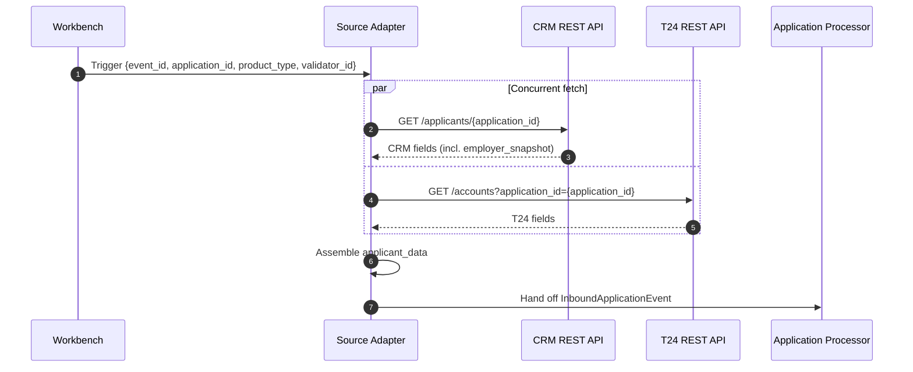
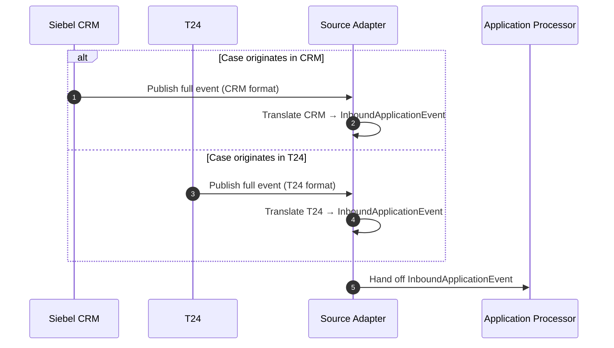
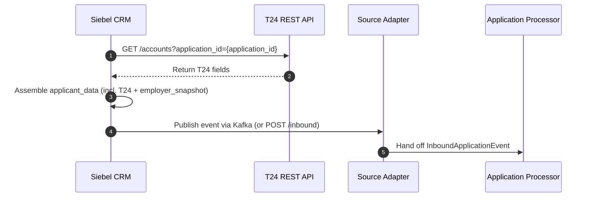
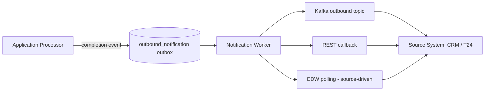

# IT Discussion — External System Integrations

This document lists the integration topics we need to align on with IT. The platform integrates with four external systems: **Siebel CRM**, **T24**, **DMS**, and **EDW**. Each topic below names a system or integration concern, summarises the design choice, and lists what we need the owning team to confirm.

---

## Topic 1 — Inbound Integration Pattern (CRM, T24)

A **Source Adapter** in front of our pipeline normalises the input into a single internal event, so the core processing never changes. Three patterns are possible — they differ only in *who assembles the payload* and *when*.

### Pattern A — Pull on demand

The Workbench triggers the Source Adapter, which calls CRM and T24 read APIs to assemble the full payload. No dependency on source systems to push events — we own the trigger.

> No outbound notification needed: results are surfaced directly in our Workbench.
>
> **What we need from IT:** API access to both CRM and T24 — endpoint contracts, authentication, and SLAs.

### Pattern B — Push from one of multiple sources

CRM publishes events for its products (Personal Finance, Credit Cards, Auto Lease); T24 publishes mortgage events. Each in their own format — the adapter normalises both into the internal contract.

> **What we need from IT:** How will each system call our system — via API or Kafka? An outbound notification is also required so each source system knows when processing is complete and can take action.

### Pattern C — Push from a single source ⚠️ Not recommended

CRM acts as the sole publisher and pre-fetches all data — including mortgage cases from T24 — before sending us one self-contained event.

> **Not recommended:** mortgage cases live in T24, not CRM. This pattern requires T24 to push mortgage data to CRM first, creating an additional cross-system dependency that is outside our control and adds failure points.
>
> **What we need from IT:** T24 would need to fetch mortgage case data and forward it to CRM before CRM can publish to us. This handoff between T24 and CRM must be owned and implemented by IT.

---

## Topic 2 — DMS Integration

We need to understand how DMS works end to end. Our assumption is that DMS exposes a way to **fetch documents by ID** and **upload new documents**, with each document carrying metadata such as type and filename. We reference documents solely by their DMS-issued ID — we never store documents ourselves; they are loaded into memory for AI processing and discarded.

A key dependency: the pipeline needs to know the declared type of each document (e.g. ID document, salary certificate) from DMS metadata, so the AI verification step knows what to check against.

---

## Topic 3 — Outbound Completion Notification

Once a case is fully delivered (PDF uploaded to DMS, structured payload exported to EDW), **the originating source system needs to know so it can take action** — assign the case to the Validator's queue in CRM, surface the recommendation, link the report. The pipeline cannot drive any business action on its own; the source system owns that.

Three channels are possible:

| Channel | Mechanism | Trade-off |
|---|---|---|
| **Kafka outbound topic** | We publish to e.g. `credit-applications.completed`; source subscribes | Decoupled, durable, replayable; needs source to consume Kafka |
| **REST callback** | We POST to a per-source `callback_url`, ack on 2xx | Synchronous push; needs source to expose an inbound HTTP endpoint and accept idempotent retries |
| **EDW polling** | Source reads `edw_staging` / EDW on its own schedule | No live push; latency depends on poll frequency; only viable if the source already runs a polling job |

In all three cases, delivery uses a **transactional-outbox pattern** — the notification is persisted in the same Postgres transaction that marks the case complete, and a Notification Worker delivers it asynchronously. A source-system outage cannot block a case from completing on our side.

---

## Topic 4 — Embedding the Workbench in CRM (iframe)

The Validator Workbench is a web application we build and host. To avoid forcing validators to switch between two separate tools, the preferred approach is to embed the Workbench directly inside the CRM case view as an iframe — the validator stays in CRM and sees the full report and validation breakdown without leaving the application.

**Question for IT / CRM team:** what are the steps required to embed an external web application as an iframe inside a Siebel CRM case view? Specifically — is iframe embedding supported in the version of Siebel CRM in use, what approval or configuration process is required, and are there any CSP or network restrictions that would block content loaded from our hosting environment?

